# Foundry system big-picture review guide

**Date:** 2026-08-24
**Audience:** an agent or developer assuming responsibility for the corpus,
retrieval, Foundry, knowledge-graph, or research-product work
**Status:** outcome-blind architecture and operating guide; it does not
authorize a realized-outcome read, a production policy change, or interference
with the active v12 lanes
**Authoritative live-work record:** `HANDOFF.md` takes precedence over the
point-in-time status in this document

## Executive summary

The system is trying to solve one difficult portfolio problem:

> From a very large set of legal DFS lineups, create an exact-size tournament
> book whose best lineup has unusually high large-field contest equity.

It has two separate decision stages:

1. **Population/fill:** which lineups are generated and therefore exist in the
   candidate corpus?
2. **Admission and retrieval:** from that corpus, which lineups are eligible,
   and which exact-size set is selected as the final book?

Those stages must remain separately measurable. A better candidate may never
be generated; a generated candidate may be filtered out at admission; an
admitted candidate may be rejected because it adds little marginal value to
the rest of the book. Looking only at the final score cannot identify which
stage failed.

The current production-compatible system generates candidates through several
families and selects a portfolio by greedy simulated-world coverage at 194 DK
points. That selector is effective at its stated coverage objective, but 194
coverage is not the same objective as maximizing the weekly tournament score.
Prior work found that boom-generated lineups were disproportionately common in
the realized corpus tail, yet an all-boom population raised the corpus ceiling
without materially improving the selected book. That is the central lesson:
**fill and retrieval interact, and neither can be optimized credibly in
isolation.**

The active v12 batch is a 54-slate, seven-arm fill-ablation experiment. It
changes five lineup feasibility rules one at a time and together, while
holding the worlds, visit budget, solver, scoring, and selector fixed. v12 is a
valuable diagnostic substrate, not the finished Foundry.

The next retrieval release, R6-v2, is designed to reconstruct the cross-arm
candidate union, score every eligible lineup in every simulated world, apply
fold-safe admissions, run seven exact-80 selectors, and retain the complete
books and marginal selection traces. Most of that pure analysis path is now
implemented and focused-test green, but it still needs a real accepted-v12
artifact smoke, a release/publisher path, a runtime benchmark, and the terminal
v12 panel index before it can produce authoritative panel results.

Foundry Next is the reusable system that follows. It will expose supported fill,
admission, retrieval, threshold, weight, fold, and entry-budget parameters
through canonical manifests. Once a science release and reusable jobs are
certified, ordinary experiments will be configuration-only runs rather than
new builds and deployments. Immutable files remain authoritative; a dedicated
Neo4j database indexes relationships and results; FastAPI exposes bounded read
models; and the React UI makes the experiment evidence understandable.

## The system at a glance

```mermaid
flowchart LR
    A[Point-in-time slate and player sources] --> B[Immutable source snapshot]
    B --> C[Five R-world matrices]
    C --> D[Fill preset and generation methods]
    D --> E[Canonical candidate corpus]
    E --> F[Complete lineup x world scoring]
    F --> G[Admission preset]
    G --> H[Retrieval preset]
    H --> I[Five fold-fit books]
    H --> Q[Distinct all-five-block final-fit book]
    I --> J[Held-out simulated evaluation]
    Q -. only after every intended final-fit book is frozen .-> K[Controlled realized grading]
    J --> L[Immutable accepted evidence]
    K --> L
    L --> M[BigQuery fact projection]
    L --> N[Dedicated Neo4j research projection]
    M --> O[FastAPI read model]
    N --> O
    O --> P[React research UI]
    P -. never controls execution .-> Q[Human review and promotion decision]
```



Three boundaries in this diagram are deliberate:

- Simulated scores may be used to create and select a book. The governed
  v12/R6 realized outcomes may not be opened until every intended all-block
  final-fit primary, secondary, negative-control, and neutral book is frozen.
  Separately designated already-viewed development outcomes may be used only
  in explicitly exploratory Tier-E work.
- Neo4j and the UI explain evidence. They do not control a run or activate a
  live strategy.
- A scientific experiment is identified by its inputs and methods, not by a
  transient Cloud Run execution name or UI release.

## 1. Capability map: what exists versus what is planned

| Layer | Purpose | Current state |
|---|---|---|
| Classic production-compatible lineup engine | Generate a bounded candidate set and select a tail-coverage book | Operational code and adopted policy exist |
| Corpus retrieval engine v1 | Score a complete immutable union and compare four selectors | Outcome-blind task-0 engineering pilot exists; not policy authority |
| v12 parametric batch | Compare five rule relaxations plus their joint relaxation over 54 slates | Running in two lanes; not yet terminal at this document's status snapshot |
| R6-v1 | Compare cross-arm admissions and retrieval laws | Formally non-executable as registered; preserved as history, not a negative scientific result |
| R6-v2 pure analysis surface | Fold-safe cross-arm reconstruction, admissions, seven selectors, books, and traces | Local fixture-focused implementation is green but unreleased; real-artifact smoke/release/publishing still pending |
| Corrected receiver/defender matchup source | Supply historically defensible pre-lock matchup evidence | Current feed is not PIT; corrective design is documented but not complete |
| Foundry Next manifest engine | Run supported fill/admission/retrieval experiments without redeploying | Detailed implementation plan exists; core platform work follows v12 seal |
| Dedicated Neo4j research graph | Index strategies, lineups, traits, experiments, books, and results | Offline focused-green projection/transport foundation and a local evidence-graph v1 exist; no live connection, accepted load, or production graph release |
| FastAPI + React research product | Show readiness, experiments, cohorts, books, traces, and provenance | Corpus Research has a vendored React 18/HTM compatibility app; a React 19/TypeScript/Vite scaffold exists but is not integrated, and most other routes remain server-generated HTML |

The most important reviewer discipline is to preserve these state labels.
“Designed,” “implemented,” “tested on fixtures,” “smoked on a real artifact,”
“released,” and “accepted over the full panel” are different claims.

## 2. What the system is optimizing

The ultimate goal is large-tournament performance, not simply projection mean,
the number of individually attractive lineups, or one threshold count.
Operationally, the closest current portfolio estimand is the weekly maximum of
an exact-size book:

```text
S(book, slate) = max realized_score(lineup) over lineups in the book
```

Before outcomes are available, the analogous simulated set objective is based
on the maximum score reached by the book in each world:

```text
J(book) = sum_scenario q(scenario) * u(max score in the book for scenario)
```

Different retrieval laws choose different utility functions `u`:

- binary coverage at 194;
- strict coverage above 200;
- weighted coverage above 200/210/220;
- expected book maximum;
- block-supported tail utility; or
- regime-robust tail utility.

The 194 threshold is retained because it provides continuity with prior work.
It must not be labeled a win probability or treated as the universal
tournament objective. The complete historical scorecard should retain weekly
book maximum, 194/200/210/220 and higher thresholds, simulated corpus/book
maxima, and—after controlled grading—realized corpus ceiling, realized
conversion gap, field-relative rank, duplication, payout, and ROI whenever the
necessary contest data exist.

## 3. How lineups are created today

### 3.1 Input slate and legal roster space

The normal live CBWU request operates on one logical pre-lock slate and one
allowed player-ID/salary universe, but it currently recomputes the model slate
and draws separately for R0–R4 and for the alternate-role belief surface. It
does not prove that all five seeds were derived from one immutable shared input
snapshot; `combine_cbwu_books` checks compatible player IDs rather than exact
source/model identity. Foundry's canonical source snapshot is intended to
close that gap.

A legal DraftKings Classic roster contains nine distinct players in the
required position slots, stays at or below the salary cap, and satisfies DK
hard rules. The normal classic request defaults include:

- minimum salary of 49,000;
- at least two QB teammates;
- at least one opposing bring-back;
- no RB against the lineup's DST; and
- no two RBs from the same team.

The 49,000 floor and same-team-RB ban are pinned by the normal adopted policy.
QB stack minimum, bring-back minimum, and RB-versus-DST behavior are
request-overridable in the live API, as is the tail line. The current classic
policy identity records the tail line but not all three request stack values,
which is a replay-identity gap to close before claiming full request-level
reproduction.

These five settings are closed research parameters in v12. They are not the
entire legal or behavioral rule set: position legality, the salary cap, player
availability, the world schedule, generation budget, deduplication, and
selection law still exist even when all five are relaxed.

### 3.2 Current candidate families

The classic `tail_select_lineups` path constructs a candidate pool from several
families. The counts below mix unique-output targets and scheduled optimization
visits, so they should not be added and called a solve budget.

| Family | Normal production target/schedule per seed | What it is trying to supply |
|---|---:|---|
| `lev` | Request up to 160 unique projected/leverage outputs | High-mean, projection-efficient lineups with leverage shaping |
| `boom` | Visit 40 high-total simulated worlds | Lineups optimal for particular high-total simulated worlds |
| `epi` / role | Target 12 novel additions, with up to 36 attempts | Lineups robust to uncertainty in player role or opportunity |
| `qbvar` | Visit 4 variants for each of the top 8 QBs, up to 32 visits | Alternative quarterback constructions under the same slate |
| `game` | Visit 3 variants for each of the top 4 games, up to 12 visits | Explicit high-total game constructions |
| `dark` | Visit 1 concentrated variant for each of the next 10 games | Less obvious game environments and structural diversity |

The core difference is that `lev` optimizes a central projected objective,
whereas `boom` optimizes the player outcomes in one sampled world. One creates
stable mean-oriented candidates; the other creates scenario-specific tail
candidates.

Distinct native-family labels are accumulated for a roster within each seed. A
lineup reproduced by more than one family keeps those distinct labels, avoiding
the old first-family attribution bias, but production does not retain every
duplicate occurrence, count, or occurrence rank. Canonical roster identity is
the sorted set of nine player identities. Repeated rosters are incrementally
deduplicated within a seed.

The nominal maximum retained six-family population is 266 unique rosters per
seed before optional theses, not a pre-dedup solve count. Solver infeasibility,
duplicate optima, short slates, and other registered behavior make the realized
count variable. Optional user theses can add candidates and can also repair or
replace members of the greedily selected book; the selection description below
is therefore the no-thesis default.

The adopted multiseed path uses five registered seed/world blocks. It is
important that production **does not** pass the complete five-seed unique union
to the selector. CBWU sets the admitted candidate budget to the size of the R0
native pool, assigns approximately equal score-blind quotas to the five seed
buckets, fills quota shortfalls deterministically, and deduplicates in fixed
R0–R4 order. The resulting admitted pool is then cross-scored over all 50,000
worlds.

This makes the selector's surface reproducible, but it also means:

- the production corpus is a quota-truncated pool rather than the complete
  multiseed union;
- a roster appearing in several seeds is attributed to its first supplying
  seed; and
- later-seed family tags and appearance information are not fully preserved.

Foundry's neutral super-pool is intended to remove that diagnostic ambiguity:
deduplicate the complete compatible union once, retain every occurrence and
source tag, score each unique roster once, and make any later admission an
explicit versioned experiment.

### 3.3 Normal path versus executable fallbacks

The five-seed CBWU description is the normal simulated path, not every live
request path. If the role-belief inputs are unavailable, the application
automatically switches to a materially different single-seed CE12/boom28
fallback, disables CBWU and the served position scales, and uses requested `N`
as its candidate-generation basis. A four-entry Millionaire Maker fallback
therefore does not use the normal 80-entry basis. A request with simulation
disabled bypasses the six-family/CBWU system entirely.

Every experiment, saved book, and UI label must identify which path executed.
Results from the normal five-seed policy and the outage fallback are not the
same strategy.

### 3.4 What population success means

A population is not successful merely because it is large. It should add
legal, distinguishable lineups that reach valuable outcome regimes and can be
converted into a strong portfolio under a fixed compute budget. Required fill
diagnostics include:

- solve count, compute cost, and unique yield;
- duplicate and near-duplicate rates;
- structural and phenotype coverage;
- simulated tail events and breadth across independent world blocks;
- per-world simulated corpus maximum `C_sim(w)` and its summaries;
- candidates actually admitted and selected by each retrieval policy; and
- per-world simulated conversion `C_sim(w)-S_sim(w)`, plus the distinct
  realized `C_realized-S_realized` only after controlled grading.

The last two are crucial. If the corpus maximum improves while the corresponding
book maximum does not, generation found something the retrieval policy could
not harvest. Simulated and realized versions must never share an unlabeled
`C`/`S` field.

## 4. How lineups are selected today

For every admitted candidate, its nine players' simulated outcomes are summed
in every registered world. The current classic selector then greedily
constructs a requested book at the adopted/default 194 line:

1. Choose the candidate that clears 194 in the largest number of currently
   uncovered worlds.
2. Mark those worlds covered.
3. Repeatedly choose the candidate adding the most new covered worlds.
4. Break ties by individual 194 frequency and mean simulated score.
5. If no remaining candidate adds coverage, fill the exact budget using the
   registered individual fallback order.

This is a **set selector**. It values a lineup by what it adds to the lineups
already selected, not only by its individual projection or tail probability.
Two individually strong but behaviorally redundant lineups can be less useful
than one slightly weaker lineup that covers different scenarios.

Production does not currently specify an explicit identity/index tie for exact
residual ties or the saturation fill; those cases inherit set iteration. That
is a deterministic-replay hardening gap, not a registered stable tie law.

On the normal path, the licensed candidate basis is 80 entries, but the live
endpoint can request `N <= 80` from that basis. Current presets include an
80-entry qualifier book and a four-entry Millionaire Maker book. Normal support
produces exact `N`, but the live API does not independently fail closed if an
abnormal candidate pool contains fewer than requested. The single-seed outage
fallback instead uses requested `N` as its generation basis.

After selection, the application re-sorts the returned lineups by a standalone
confidence measure, so displayed/CSV order is not the selector's marginal-
coverage order. Foundry evidence must retain the true selection trace separately
from presentation order.

The selector is trustworthy for its literal objective: prior exact-optimality
work found it within roughly 0.134% of the optimum for that coverage problem.
The unresolved issue is objective alignment. Efficiently optimizing 194-world
coverage does not prove that 194 coverage maximizes realized tournament equity.

## 5. What the active v12 batch creates

### 5.1 Panel and world schedule

v12 covers 54 historical slates from 2023–2025. Each slate has five independent
world blocks, `R0` through `R4`, with 10,000 player-outcome worlds per block.
The generator does not simply visit raw world indices 0–199. In each block it
uses the exact outcome-blind top-200 schedule ranked by total slate draw, with
stable ties.

For each parameter arm and each slate:

- 200 world visits are attempted in each of five blocks;
- there are 1,000 exact optimization visits in total;
- each visit must end in a proven optimum or the task fails closed;
- visit outputs are deduplicated by canonical roster identity in first-visit
  order, without candidate truncation;
- every generated unique roster is scored over all 50,000 worlds; and
- the fixed direct greedy 194-coverage selector returns exactly 80 entries.

Across the complete panel this represents 378,000 exact optimization visits
before independent verification: `54 slates × 7 arms × 1,000 visits`.

### 5.2 The seven v12 arms

| Arm | Salary floor | QB teammates | Bring-back | RB vs DST | Two same-team RBs |
|---|---:|---:|---:|---|---|
| `incumbent` | 49,000 | at least 2 | at least 1 | forbidden | forbidden |
| `remove-salary-floor` | 0 | at least 2 | at least 1 | forbidden | forbidden |
| `remove-qb-stack` | 49,000 | 0 minimum | at least 1 | forbidden | forbidden |
| `remove-bring-back` | 49,000 | at least 2 | 0 minimum | forbidden | forbidden |
| `allow-rb-vs-dst` | 49,000 | at least 2 | at least 1 | allowed | forbidden |
| `allow-two-rb` | 49,000 | at least 2 | at least 1 | forbidden | allowed |
| `remove-all-five-shared-constraints` | 0 | 0 minimum | 0 minimum | allowed | allowed |

The seventh arm must not be called “rule-free.” It removes these five shared
house constraints while every DK hard rule and the common generation,
deduplication, scoring, and selection law remains active.

### 5.3 What v12 can and cannot answer

v12 isolates the causal effect of each registered feasibility relaxation under
one fixed generation schedule and selector. It can show whether a relaxation:

- changes feasibility or solve behavior;
- produces new unique lineups;
- changes simulated tail support;
- raises the complete-corpus ceiling;
- supplies lineups selected by the fixed coverage law; or
- changes the selected book after controlled realized grading.

It does **not** establish the best general fill policy. It uses one world
schedule, one optimum per visited world, one selected-entry budget, and one
coverage selector. A fill that interacts badly with that selector may look
unhelpful even if a different retrieval law could exploit it.

## 6. Complete corpus scoring and high-score evidence

The local R6-v2 preparation reconstructs one canonical union of unique roster
identities while retaining every v12 arm, block, visit, and occurrence. It does
not yet supply general classic generator-family tags; those must come from a
later compatible super-pool import. Every unique lineup is scored in every
registered world. For the standard five-block release, the in-memory score
matrix shape is:

```text
[number of unique lineups, 50,000 worlds]
```

No lineup or world may be sampled or silently omitted. Native candidate totals
are independently reconstructed from the player-world matrices and the
resulting matrix hash is bound into the local result. The prepared R6-v2 path
does **not yet publish** an immutable union-score NPZ or sparse `score > 200`
event sidecar. Those are required Foundry/publisher outputs: the dense matrix
belongs in immutable object storage and the threshold events in compact
identity-bound sidecars.

Once those canonical publications exist, they permit analysis by:

- player, player pair, team pair, game, stack topology, and generator family;
- world block and learned scenario regime;
- salary, ownership, projection, boom, role, and matchup traits;
- event breadth across blocks rather than raw event count alone;
- outcome-space correlation and exact duplicate score vectors; and
- separately labeled simulated corpus/book maxima and, after grading, realized
  corpus ceiling, selected-book maximum, and conversion gap.

Three cohorts must never be conflated:

1. **Simulated tail:** a lineup exceeds a threshold in one or more simulated
   worlds.
2. **Realized corpus tail:** a generated historical lineup actually exceeded a
   threshold in its contest week.
3. **Millionaire Maker winner/top finisher:** a lineup occupies a specific
   field-relative contest outcome.

A simulated `>200` event teaches what the simulation thinks is a coherent tail
scenario. A realized `>200` lineup tests transfer to one historical outcome. A
winner teaches field-relative structure, ownership, and contest context. None
is an interchangeable positive label.

## 7. What prior evidence says

The prior 54-slate population review contained 67,951 historical candidate
rows. In its realized tail census, `boom` supplied about 15.8% of the corpus
but 69.2% of the 210+ candidates; `lev` supplied about 63.3% of the corpus and
none of the 13 candidates at 210+.

That finding is important but insufficient by itself. An all-boom reallocation
raised mean realized pool ceiling by roughly nine points and improved 43 of 54
slates, while the selected book improved only about 1.34 points with a null
paired result. In other words, the fill treatment created valuable lineups,
but the fixed selector did not reliably convert them into a better book.

Similarly, changing only the selector on the incumbent pool did not establish
a winner. The correct next experiment is paired and factorial: change fill,
admission, and retrieval in a way that still identifies each component's
effect.

This evidence supports three conclusions:

- preserve a meaningful incumbent component rather than assuming all-boom is
  a complete policy;
- test boom, QB variants, topology, and other tail sleeves at equal compute
  budget; and
- judge a joint strategy by book-level outcomes, not only corpus ceiling or
  individual-lineup classification.

## 8. The corrected R6-v2 retrieval surface

### 8.1 Fold-safe candidate universes

The original R6 runner was caught before a governed realized read. It executed
only three of seven registered selectors, allowed candidate identity leakage
from the held-out block, did not retain exact books and traces, and lacked a
durable publication path. It is preserved and labeled non-executable, not
retrofitted into apparent compliance and not interpreted as a failed matchup
hypothesis.

R6-v2 corrects both score and identity leakage. For each of five cross-fit
folds:

- the held-out block's score columns are unavailable to selection;
- a lineup generated only in the held-out block is also ineligible;
- source-arm support, recurrence, first occurrence, and block/visit provenance
  are rebuilt from training occurrences only;
- score summaries, score-derived ranks, and score-derived ties are rebuilt from
  training score columns only;
- held-out origin-mask bits remain visible only to the exclusion/audit layer;
  and
- excluded lineup IDs and deterministic reason codes are retained.

After cross-fit diagnostics, one distinct **all-block final fit** creates the
books that may later be realized-graded. It is fit without realized outcomes
and is frozen before any outcome access.

### 8.2 Admissions

Admission decides which candidates a selector may see. Initial R6-v2
admissions are:

- the complete fold-eligible union, or the all-block union for final fit;
- an up-to-200 matchup-supported candidate set, admitting
  `min(200, qualifying_count)` and failing closed when fewer than 80 qualify;
  and
- 32 deterministic score/value-blind size-and-composition-matched neutral
  controls that match the matchup admission's actual size and registered
  strata.

The neutral controls are essential. They distinguish value in the matchup
signal from the generic effect of shrinking the candidate pool or changing its
source-arm composition. The number 32 remains subject to an outcome-blind
union-scale runtime benchmark before the protocol is frozen.

The current receiver/defender source is not eligible for an authoritative
matchup admission. Until corrected, it may be used only in an explicitly
marked `non-pit-retrospective` mechanics smoke.

### 8.3 Seven registered exact-80 selectors

| Selector | Portfolio question |
|---|---|
| `coverage-194-v1` | Which next lineup covers the most new worlds at `score >= 194`? |
| `strict-200-coverage-v1` | Which next lineup covers the most new worlds at `score > 200`? |
| `tail-ladder-200-210-220-v1` | Which next lineup adds the most weighted new coverage at `>200`, `>210`, and `>220`, with weights 1/4/12? |
| `mean-score-v1` | Which individual lineups have the highest discovery mean? This remains a negative control. |
| `expected-max-v1` | Which next lineup adds the most to the mean per-world maximum of the whole book? |
| `block-supported-tail-ladder-v1` | Which next lineup adds tail coverage supported across distinct training blocks rather than one-block accidents? |
| `regime-robust-ladder-v1` | Which next lineup improves the weakest block-level tail-utility profile under a leximin rule? |

Every selector returns exactly 80 unique IDs for the principal historical
comparison and retains, for every pick:

- selection rank and lineup ID;
- objective before, marginal gain, and objective after;
- threshold contributions;
- block contributions;
- tie values.

Candidate and matrix hashes, admitted/excluded sets, and redundancy diagnostics
are retained at book/scope level. Pairwise score correlation is a deterministic
bounded sample of at most 32 selected-lineup pairs, not a complete all-pairs or
per-pick product.

The execution lattice and inference roles are narrower than the Cartesian
product might imply:

- all seven selectors run on each of the two principal admissions—the full
  eligible union and matchup admission—for 14 principal cells;
- only `coverage-194-v1` runs on each of the 32 neutral admissions;
- the 14 principal cells are not 14 primary hypotheses;
- the sole primary mechanism contrast is coverage-194 under matchup admission
  versus the matched-neutral distribution;
- coverage-194 matchup versus full union is the key operational secondary;
- the other selectors are frozen secondary comparisons; and
- `mean-score-v1` remains the negative control.

Future Foundry releases will make the entry budget a registered parameter.
Four- and fourteen-entry books are first-class Week-1 needs; exact-80 evidence
must not be treated as validation for a materially different portfolio size.

## 9. What Foundry Next changes

### 9.1 Release once, run by manifest

The current project has often coupled a scientific variation to a new image,
Cloud Run job update, security census, transport proof, and deployment. That
made a single experiment slow and made platform details part of the apparent
scientific identity.

Foundry Next separates three identities:

- **Science identity:** source and world releases, generator and selector
  methods, all score/book-affecting parameters, seeds, folds, budgets, solver,
  deterministic ordering, and score-affecting code.
- **Evidence identity:** compatible independent verifier and accepted
  receipts.
- **Execution identity:** deployment attestation, job, service account,
  attempt, timestamps, and infrastructure logs.

A new science release is needed when score-affecting code, solver behavior,
dependencies, a method implementation, or a parameter schema changes. A new
supported parameter value inside a registered domain, preset combination,
fold, threshold, weight, or entry budget becomes a manifest-only experiment.
UI, documentation, graph, and orchestration changes do not redefine unchanged
science.

### 9.2 Canonical experiment manifest

One manifest binds:

- source, player universe, slate, and world artifact identities;
- science and verifier releases plus compatible deployment attestation;
- fill, admission, and retrieval presets;
- folds and discovery/evaluation assignments;
- solve and entry budgets;
- thresholds, weights, seeds, and ties;
- comparison cells and paired baselines;
- missing-data behavior and compute ceiling;
- outcome-read policy;
- evidence tier and authority flags; and
- canonical scientific and full-manifest hashes.

Only registered method IDs and typed bounded values are allowed. A manifest
cannot inject arbitrary code, SQL, Cypher, environment variables, or paths.

### 9.3 Attempts, retries, and checkpoints

A logical experiment task is separate from a physical cloud attempt. Platform
failures may retry with identical scientific input and seed under an
append-only attempt ledger. Deterministic science failures—illegal rosters,
non-optimal solves, input drift, inconsistent evidence, or replay mismatch—fail
closed. Completed content-addressed shards can be resumed without discarding
valid work or changing scientific identity.

Reusable Cloud Run task arrays, stable service accounts, bounded parallelism,
and checkpoints replace sequential deployment-per-experiment mechanics. The
target user workflow is:

```text
register preset -> submit manifest -> validate -> run -> verify -> compare
```

No image build, job redeployment, IAM rewrite, or Scheduler census should occur
for an ordinary supported experiment.

## 10. Experiments the Foundry is intended to bring

### 10.1 Population/fill experiments

Initial versioned fill families are:

| Preset | Research purpose |
|---|---|
| `F0-incumbent` | Paired control using the production-compatible mix and rules |
| `F1-tail-family` | More boom/tail and bounded QB-variant/role supply at equal solve budget |
| `F2-winner-support` | Soft sleeves covering stack, bring-back, concentration, salary, and ownership shapes underrepresented by the incumbent |
| `F3-phenotype-conditional` | Cross-fitted soft bonuses or quotas for portable simulated/realized tail traits |
| `F4-hybrid` | A fixed hedge across tail, winner-support, phenotype, and novelty sleeves |
| `F-negative` | Equal-budget removal of one sleeve or feature family to establish mechanism |

Generation methods to compare include:

- the current exact world optimum;
- near-optimal enumeration with no-good cuts;
- deterministic unique-fill to a count or compute ceiling;
- portfolio column generation based on marginal uncovered scenarios;
- stratified world generation rather than only high-total worlds;
- residual/tail-event targeted generation; and
- topology, matchup, winner-support, and phenotype sleeves.

The world schedule itself is an experiment. At equal visit budget, compare the
current top-total-world schedule with slate-total strata, high-lineup-ceiling
worlds, game-regime strata, uncovered-event worlds, block-balanced samples,
and a deterministic mixture.

### 10.2 Admission experiments

Admission presets will test:

- full fold-eligible/all-block union;
- fill-specific pools;
- simulated-tail support and lower-bound gates;
- cross-fitted realized-tail posterior;
- winner-support topology;
- boom support;
- corrected matchup support and completeness;
- ownership, leverage, and duplication;
- Pareto/dominance pruning;
- novelty or residual-scenario support; and
- fixed mixtures reserving incumbent representation.

Every bounded signal-based admission requires a score-blind, size/composition-
matched control and a discarded-opportunity diagnostic.

### 10.3 Retrieval experiments

The seven R6-v2 laws provide the baseline selector catalog. Later candidates
include genuine tail lower-confidence bounds, contest-relative expected max,
duplication-adjusted expected payout, scenario-cluster coverage,
correlation-aware expected max, hybrid support, and fixed selector ensembles.
Every method must expose an interpretable marginal trace.

### 10.4 Factorial attribution

The minimum joint comparison is a paired 2×2:

| | Incumbent retrieval | Challenger retrieval |
|---|---|---|
| Incumbent fill | baseline | retrieval-only effect |
| Challenger fill | fill-only effect | joint strategy and fill×retrieval interaction |

Once admission is explicit, the complete design is 2×2×2: incumbent versus
challenger fill, admission, and retrieval. All cells share the same slate,
worlds, seeds, legality, and final budget. Fill contrasts have equal solve
budgets; admission contrasts start from the same source snapshot; retrieval
contrasts receive identical admitted candidate IDs and scores.

Exploration may screen many manifests, but frozen evaluation should nominate a
bounded family: baseline, at most one primary joint strategy, and one
materially distinct fallback. Selecting the best of dozens and reporting it as
an untouched comparison is not valid evidence.

## 11. Learning from winners and high-scoring lineups

The canonical research row should be one `(slate snapshot, lineup ID)` with
separate pre-lock features, simulated summaries, lineage, selection membership,
and outcome labels. Large matrices remain outside the table and are referenced
by immutable identity.

### 11.1 Feature families

Portable analysis should include:

- salary used/left and slate-relative salary shape;
- QB teammate, bring-back, secondary-stack, team, and game concentration;
- projection, ceiling, boom, uncertainty, and leverage;
- ownership shape and duplication proxy using pre-lock ownership forecasts;
- opportunity, route, target, carry, snap, and vacated-role features;
- player, pair, team, and game relationships;
- simulated tail counts, posterior rates, block breadth, and scenario regime;
- receiver/RB/QB matchup and opponent positional concessions;
- inferred defender/alignment exposure with explicit uncertainty;
- score-vector correlation, event overlap, and novelty; and
- slate context such as pricing tightness, ownership entropy, game totals, and
  injury concentration.

Player, team, season, week, and outcome identity can be used for lineage and
matching. They must not become transferable coefficients that merely memorize
historical slates.

### 11.2 Denominators and support

“X percent of winners had this trait” is not enough. Winners must be compared
with same-slate controls from the incumbent corpus, broad super-pool, legal
generated alternatives, and actual contest fields when available. Tail
associations must report support in distinct lineups, slates, seasons, and
world blocks. Correlated worlds are not independent contests.

The project currently has a known winner collection that requires reconciliation:
a broader 68-contest registry and a governed 51-row 2023–2025 feature-complete
cohort must remain distinct until player, contest, salary, score, and ownership
authority is reconciled. Prospective 2026 collection should capture the top 10,
top 100, top 0.1%, full field where licensed, duplication, rank, payout, and
ownership—not only first place.

### 11.3 Transfer into generation and selection

Winner and tail knowledge can enter the system in three bounded ways:

- **Generation:** soft objective bonuses, quotas, or dedicated sleeves create
  candidates with supported portable traits.
- **Admission:** a cross-fitted tail, winner-support, boom, matchup, or novelty
  model produces a bounded shortlist, paired with a neutral control.
- **Set selection:** traits affect scenario weights, constraints, or stable
  tie-breaks while marginal portfolio utility still decides the exact book.

No trait should become a universal hard rule from a small winner sample. The
test is whether it adds book-level value out of fold and prospectively.

## 12. Receiver/defender matchup intelligence: current boundary

The intended matchup program is deeper than counting a generic “easy coverage”
flag. It is meant to estimate receiver role, opponent concessions to that role,
Wide/Slot alignment, defender workload and efficiency, coverage shell, and the
support/missingness of every component. It should answer questions such as
whether a WR1 faced a defense that had allowed elevated production to WR1-like
roles before lock—not retroactively label a matchup from the game being
predicted.

There are related but distinct implementation paths: the all-week SQL build
`017l`–`017s`; per-slate Python publishers for receiver and RB/QB annotations;
and the R6-v2 runner's current caller-supplied row seam. They must not be
described as one already unified authority. In particular,
`scripts/build_receiver_matchup_features.py` continues through `017s`, which
reads `actual_gt_200`/`actual_score`; that script is forbidden as an R6
pre-freeze source path.

The current `017r` matchup feed cannot honestly be called point-in-time for
2023–2025. The detailed audit confirmed, among other defects:

- completed target-season Fantasy Points coverage enters one component;
- target-week postgame participation determines portions of the player
  universe;
- current-week depth rows lack sufficient as-of evidence;
- a defender's rolling window can mix teams after a trade;
- source roles and actual rows do not always match;
- maximum source time is asserted by the caller rather than derived; and
- the existing build script proceeds into a step that reads realized outcomes.

Current data is safe only for a clearly labeled
`non-pit-retrospective` mechanics smoke. The minimum corrective seam is two
create-once per-slate objects plus an exact reopen of the immutable player
catalog that defines the target universe. Only task 0 currently has a checked
exact catalog/query receipt, so later slates require equivalent catalog
authority.

The two new objects are:

1. `matchup-source-export.json`, containing catalog-complete outcome-free rows,
   components, support, edge, and exact source hashes; and
2. `matchup-query-receipt.json`, binding the catalog, export, SQL/query,
   source seasons and event windows, derived maximum source time, lock time,
   percentile universe, evidence class, and explicit leakage flags.

For retrospective R6-v2 use, the feed must at least achieve the audited
`retrospective-prior-period-reconstruction` class. For genuine 2026 evidence,
capture contemporaneous pre-lock sources and timestamps prospectively.

## 13. Storage and knowledge graph

### 13.1 Authority by storage layer

| Layer | Role | Authority boundary |
|---|---|---|
| GCS | Create-once source snapshots, matrices, candidate bodies, books, traces, receipts, and grades | Content authority |
| BigQuery | Canonical lineup facts, cohort summaries, metrics, and efficient analytical joins | Rebuildable query projection |
| Dedicated Neo4j | Compact identities, relationships, presets, lineage, traits, books, experiments, and result links | Rebuildable relationship index; never run authority |
| FastAPI | Typed, paginated, bounded read model | No arbitrary SQL/Cypher and no strategy activation |
| React UI | Human research and evidence visualization | Read-only decision support |

Neo4j should not store 50,000-world matrices, per-world nodes, raw licensed
Fantasy Points/SIS data, credentials, raw standings, or mutable live-policy
pointers. It stores pointers and compact summaries. It must be possible to
delete the graph and reproduce it from accepted GCS/BigQuery evidence with the
same terminal counts and canonical query hashes.

### 13.2 Core graph concepts

The graph connects:

- science, verifier, deployment, source, and world releases;
- fill, admission, and retrieval presets;
- experiment manifests, cells, runs, attempts, folds, and evaluations;
- slate snapshots, corpus snapshots, lineups, players, teams, and games;
- generated, admitted, excluded, selected, and member-of-book lineage;
- traits, cohorts, winners, outcome grades, and metric sets; and
- strategy bundles and human promotion decisions.

A `StrategyBundle` is the exact versioned unit considered for use: fill +
admission + retrieval + entry budget + sleeve allocation + fallbacks + source
requirements + science release. Neo4j must not hide admission inside retrieval
or treat one global entry budget as universal.

### 13.3 Questions the graph should answer

- Which fill/admission/retrieval combinations performed best under the same
  worlds and budget?
- Did a candidate fail to be generated, fail admission, or fail marginal
  selection?
- Which arms, families, traits, players, pairs, teams, or games supplied tail
  support across multiple slates and blocks?
- How do winners, matched controls, simulated tails, realized tails, and
  selected books differ?
- Did matchup/easy-coverage evidence help beyond a size-matched neutral pool?
- Which selected lineups are redundant in score/event space?
- Why was one lineup selected at a particular step?
- What exact evidence and release support a displayed metric or promotion
  decision?

## 14. React product vision

The present state is transitional: Corpus Research uses vendored React 18 with
HTM, the separate `frontend/` directory contains an unintegrated React 19/
TypeScript/Vite scaffold, and most application routes still render server-side
HTML. The target is one integrated, reproducibly built frontend—not a claim
that this migration has already occurred.

The React UI should make the full funnel visible:

```text
visits -> proven optima -> unique corpus -> admitted pool -> selected book
       -> simulated tails -> frozen grade -> contest outcome
```

Primary views are:

- readiness and panel status;
- fill × admission × retrieval experiment matrix;
- paired slate outcomes and season influence;
- threshold and expected-max curves;
- candidate funnel and separately labeled simulated `C_sim/S_sim` and realized
  `C_realized/S_realized` decompositions;
- winner/control/simulated-tail/realized-tail cohort comparison;
- boom, topology, role, matchup, ownership, pair, and correlation traits;
- lineup roster, provenance, annotations, and exact why-selected trace;
- portfolio correlation/event clusters and effective rank;
- source quality and missingness;
- strategy lineage from preset through decision; and
- contest rank, duplication, payout, and ROI when complete data exists.

Every view must label simulated versus realized, discovery versus held-out,
retrospective versus prospective, evidence tier, denominator, missingness,
source release, and staleness. Missing is never rendered as zero. Inferred
defender exposure is visibly qualified. A graph outage should degrade Foundry
drilldowns while leaving the lineup application and last verified release
available.

The web image and release cadence are separate from Foundry science. Frontend
changes must not require a new generator/analysis image or redefine experiment
identity.

## 15. Trust and decision rules

The system is trustworthy only if these properties remain visible and tested:

1. Every source, world, corpus, book, and grade resolves to an immutable exact
   identity.
2. Every unique lineup in an experiment is scored across every registered
   world; missing matrix rows fail closed.
3. Held-out evaluation removes both held-out scores and held-out-only
   candidate identities.
4. Fill comparisons use equal compute and the same retrieval law; retrieval
   comparisons use identical candidate and score inputs.
5. Every selector produces the exact registered book size, exact IDs, and a
   replayable marginal trace.
6. Pre-lock features and outcomes are stored separately. Every intended
   all-block final-fit primary, secondary, negative-control, and neutral book
   is immutable before the governed v12/R6 outcomes are read.
7. Missing source coverage remains explicit; no unavailable feature is
   silently set to zero.
8. Neo4j and the UI cannot run experiments, write science authority, or
   activate production policy.
9. Historical exploratory and retrospective results nominate; genuinely
   untouched or prospective evidence confirms.
10. A production change requires an explicit reviewed limited-deployment or
    promotion receipt and operator action.

Foundry uses three authority tiers:

- **E — exploratory:** rapid reproducible work on simulated or already-viewed
  development evidence; no promotion authority.
- **V — frozen evaluation:** a bounded preregistered family, exact books and
  traces, then one controlled retrospective or prospective grade.
- **P — production:** pre-lock books, deterministic fallbacks, export
  rehearsal, rollback, and explicit operator-approved deployment decision.

Because 2023–2025 has already influenced substantial development, R6-v2 can at
most earn the label preregistered retrospective evaluation, not fresh
confirmation. It earns even that label only if the corrected protocol and all
intended all-block final-fit books are frozen before the governed outcome
source is accessed. Any earlier arm-only or partial governed actual-score read
demotes the later R6-v2 panel comparisons to exploratory. Prospective 2026
pre-lock books provide the cleanest remaining confirmation.

## 16. Current progress snapshot

This subsection is a dated snapshot, not a substitute for `HANDOFF.md` or the
lane logs.

As of **2026-08-24 22:35 UTC**:

- v12 lane A had 19/28 tasks verifier-accepted and was running task 19;
- v12 lane B had 19/26 tasks verifier-accepted and was running task 19;
- the combined panel stood at 38/54 accepted slates;
- there were zero recorded task failures, retries, or interventions; and
- the governed v12/R6 actual-score source remained unread.

Local pre-G0 preparation for post-G0 execution completed while the lanes ran:

- v12 artifact import adapter: 7 focused tests passed;
- corrected R6-v2 batch retrieval runner: 21 focused tests passed;
- combined v12 panel-index builder and publisher: 18 focused tests passed;
- snapshot artifact-dialect compatibility: 5 focused tests passed; and
- one-slate R6-v2 orchestration seam: 6 focused tests passed.

These modules are local, fixture-tested, and unreleased. The one-slate suite
stubs downstream component calls; a real-artifact smoke, accepted publisher,
and completion path remain pending. The prepared path is designed to support
both accepted carrier dialects, exact panel and task identity binding, five
fold-safe scopes, a distinct all-block final fit, all seven selectors,
fold-local candidate provenance, full union/matchup/neutral admissions, and
exact books and traces.

The legacy R6-v1 non-executable disposition and the receiver-matchup PIT
lineage disposition are written. No controlled v12 grade or production policy
decision has been made from this work.

One boundary event should be recorded precisely for the next reviewer: a broad
local report search exposed lines from an older report containing historical
aggregate score text. It did not open or resolve the governed v12/R6 actual-
score source, did not grade v12, and did not drive a method change. Do not
replace that qualified statement with the broader claim that no historical
score text was ever visible.

## 17. Challenges currently encountered

### 17.1 The v12 batch is intrinsically large and operationally sequential

The active batch performs 378,000 exact optimization visits, complete
cross-scoring, evidence publication, and independent verification. Each lane
advances one one-shot task at a time, with zero automatic scientific retries.
Observed cadence has been roughly 70 minutes per slate per lane. The multi-day
runtime is therefore mainly the consequence of v12's execution design and
scale, not evidence that a single score calculation has been stuck for days.

This is the last experiment that should require this deployment-heavy pattern.
Reusable task arrays, stable releases, bounded parallelism, and checkpoint/
resume are explicit Foundry Next requirements.

### 17.2 Real artifacts have multiple accepted schema/canonicalization dialects

The accepted history contains `variant_results` and
`variant_result_objects` carrier shapes, and transport-level JSON newline
hashing differs from some inner canonical bodies. Synthetic tests did not
initially expose all of this. The new import and panel-index layers now handle
the real accepted dialects explicitly, but the real-v12 one-slate smoke remains
non-negotiable before a release is certified.

### 17.3 The old retrieval implementation was incomplete

R6-v1 ran only three registered laws, leaked held-out-only candidate
identities, omitted exact book/trace evidence, and had no accepted publisher.
These are protocol/implementation defects, not a scientific result. The
successor code addresses them, but a full real-artifact and publication path
still has to prove the correction.

### 17.4 Matchup data is not yet point-in-time

The desired receiver/defender analysis is scientifically valuable, but the
current source chain has confirmed target-season and target-week leakage plus
lineage defects. Until the corrected catalog-plus-two-object source seam is built and
validated, matchup experiments can test mechanics only and cannot support a
frozen retrospective conclusion or live policy.

### 17.5 Full-union retrieval may be expensive

One slate's unique-lineup score matrix can be several gigabytes. At the default
neutral dose, R6-v2 constructs exactly 46 books in each scope:

```text
7 selectors × 2 principal admissions + 32 neutral replicates
```

There are six scopes per slate—five cross-fit folds plus the all-block final
fit. The default full panel is therefore `46 × 6 × 54 = 14,904` book
constructions, of which `46 × 54 = 2,484` are final-fit books. The v2 algorithm
avoids unnecessary copies and bounds correlation sampling, but union-scale
memory, runtime, and cost must be measured on one accepted slate before the
neutral replicate count and panel fan-out are frozen.

### 17.6 Winner and contest evidence is incomplete

The two winner cohorts require authority reconciliation, and historical full
contest fields are not generally present. Without full entries and payout
curves, the system cannot honestly infer top-five rank, duplication, or ROI
from winner-only files. Prospective standings capture is a high-value Week-1
requirement.

### 17.7 Retrospective adaptation can overstate confidence

Many project ideas have already been shaped by 2023–2025 results. Cross-fitting
prevents direct score/candidate leakage inside an analysis, but it does not
turn repeatedly studied seasons into untouched confirmation. Evidence labels,
bounded frozen families, season influence, and prospective 2026 operation are
therefore required.

### 17.8 Governance previously dominated iteration time

Strict source identity, exact replay, outcome freezing, and independent
verification are useful. Repeating broad IAM/Scheduler censuses, new jobs, and
deployment proofs for every threshold or preset is not. Foundry Next keeps the
trustworthy scientific controls and moves renewable infrastructure checks into
a deployment attestation that is reused until it expires or drifts.

## 18. Immediate sequence from here

### Gate G0 — finish and seal v12

1. Let both existing lane drivers reach their terminal accepted/failed state;
   do not mutate or relaunch active tasks.
2. If every task in a lane is accepted, run `finish-batch` once for that lane
   from the frozen v12 worktree. If any task failed or is absent, publish the
   lane's terminal non-completion disposition instead; do not forge or invoke
   a completeness receipt.
3. Only if both lanes have valid complete finish receipts, build and create-
   once publish the complete combined panel index binding both receipts and all
   54 source-task ordinals. A failed-lane disposition stops this complete-panel
   path and requires a separately specified accepted-subset protocol.
4. Exact-reopen and replay whichever terminal receipts/dispositions were
   validly produced and, when permitted, the combined panel index.
5. Update and commit `HANDOFF.md` with durable task/execution and completion
   identities.

### First trustworthy comparative simulated books

6. Commit/release the prepared import, runner, panel-index, and one-slate
   orchestration code without staging active lane scratch artifacts.
7. Add the narrow analysis CLI/publisher/completion receipt.
8. Run one accepted v12 slate end to end, outcome-blind, using exact real
   artifacts.
9. Benchmark union-scale memory/runtime and freeze the neutral replicate dose.
10. A current non-PIT source may run only the real-artifact mechanics smoke,
    after which that branch stops. Correct and publish the matchup source seam,
    including immutable catalog reopening, before any matchup-primary freeze.
11. Proceed with the described R6-v2 matchup-primary protocol only after the
    source reaches at least `retrospective-prior-period-reconstruction` and
    structural replay plus substantive temporal evidence both pass. Otherwise
    write and review a separately revised protocol that removes the matchup
    hypothesis; merely “omitting authority” is not enough.
12. Freeze the valid protocol's manifest, selectors, admissions, final-fit
    books, traces, metrics, missingness rules, and evidence class, then run the
    complete 54-slate simulated panel and publish comparative metrics.

### Controlled outcomes and reusable platform

13. Only after every intended valid-protocol book is frozen, acquire the
    outcome lease and perform the one controlled retrospective grade.
14. In parallel after v12 seal, implement Foundry Next science/verifier
    releases, manifests, reusable jobs, checkpoints, registry, and telemetry.
15. Build the canonical lineup evidence table and deep winner/tail/matchup/
    correlation features.
16. Load the dedicated Neo4j projection, expose bounded FastAPI endpoints, and
    build the React experiment/cohort/lineup views.
17. Run paired fill × admission × retrieval screens, nominate a small frozen
    family, rehearse a stored slate through a legal DK CSV, and prepare the
    prospective Week-1 evidence packet.

Neo4j and complete visual polish do not block the first comparative simulated
scores or the controlled grade. They can proceed in a separate product lane
once accepted facts exist.

## 19. Reviewer checklist

The reviewing agent should answer these questions before implementing or
approving the next release:

### Architecture and identity

- Are production, v12, R6-v2, and Foundry Next clearly distinguished?
- Does every score- or book-affecting value belong to scientific identity?
- Can unchanged science survive an execution/verifier/UI repair without being
  silently redefined?
- Is every graph/API/UI result rebuildable from immutable accepted evidence?

### Generation

- Is the fill budget equal across causal comparisons?
- Are all generator occurrences and arm/block provenance retained after
  roster deduplication?
- Can the method create missing topology/phenotype support rather than merely
  reweight existing lineups?
- Are world schedules registered and outcome-blind?

### Admission and retrieval

- Does a fold exclude held-out-only candidate identities as well as score
  columns?
- Are score-derived and provenance-derived features fold-local?
- Does every signal admission have the correct full-union and score-blind
  matched controls?
- Do all seven registered selectors run on identical inputs and produce exact
  books and replayable traces?
- Is the portfolio budget the intended contest budget rather than a global
  inherited constant?

### Evidence and outcomes

- Are simulated tail, realized corpus tail, and winner/top-finisher cohorts
  kept separate?
- Do enrichment claims include matched denominators and support by slate,
  season, and world block?
- Are matchup features assigned the evidence class their lineage supports?
- Were every book and metric definition frozen before the governed outcome
  read?
- Is retrospective evidence labeled retrospective rather than confirmatory?

### Operations and product

- Can a supported manifest run without a new build, deployment, IAM rewrite,
  or Scheduler census?
- Can infrastructure failure resume without changing scientific identity?
- Can graph/API/UI failure leave generation and lineup export healthy?
- Do UI charts expose evidence tier, denominator, missingness, source, and
  staleness?

## 20. Important implementation entry points

### Current production-compatible path

- `src/nfl_dfs/backtest/engine.py` — `tail_select_lineups`, generator families,
  candidate deduplication, and tail selector integration.
- `src/nfl_dfs/app/main.py` — `POST /lineups`, `_build_classic`, request-level
  overrides, normal/fallback dispatch, and response ordering.
- `src/nfl_dfs/optimizer/lineup.py` — adopted `select_tail_entries` /
  `select_from_support` final selector.
- `src/nfl_dfs/inference/production_policy.py` — adopted policy values, seeds,
  world counts, candidate and selector configuration.
- `src/nfl_dfs/inference/multiseed_portfolio.py` — candidate/world union,
  reconstruction, and fixed-budget CBWU admission. Its compact bitpacked
  selector is used by CBWU-OI/volume research shadows, not the adopted final
  CBWU selector.
- `src/nfl_dfs/inference/live_lineups.py` — live construction orchestration and
  candidate persistence.

### v12 and R6-v2 path

- `src/nfl_dfs/research/corpus_parametric_batch.py` — exact seven-arm v12
  manifest and parameter contract.
- `src/nfl_dfs/research/corpus_legal_feasibility.py` — exact solver,
  deduplication, complete scoring, and fixed selector.
- `src/nfl_dfs/research/corpus_v12_import.py` — accepted-v12 compatibility and
  reconstruction adapter.
- `src/nfl_dfs/research/corpus_v12_panel_index.py` and
  `scripts/build_corpus_v12_panel_index_v1.py` — combined terminal panel index.
- `src/nfl_dfs/research/corpus_retrieval_engine.py` — registered retrieval laws
  and core complete-corpus analysis.
- `src/nfl_dfs/research/corpus_batch_retrieval_runner_v2.py` — corrected folds,
  admissions, selectors, books, traces, and diagnostics.
- `src/nfl_dfs/research/corpus_r6_v2_one_slate_execution.py` — outcome-blind
  one-slate exact-read orchestration seam.

### Matchup and product path

- `src/nfl_dfs/research/receiver_matchup_contract.py`,
  `receiver_matchup_annotations.py`, and `rb_qb_matchup_annotations.py` —
  per-slate matchup contracts/annotation logic requiring temporal correction.
- `scripts/annotate_receiver_matchup_slate.py` and
  `scripts/annotate_rb_qb_matchup_slate.py` — separate per-slate publishers.
- `scripts/build_receiver_matchup_features.py` and SQL `017l`–`017s` — all-week
  build; `017s` is outcome-bearing and forbidden before an R6 freeze.
- `src/nfl_dfs/research/corpus_retrieval_neo4j.py`,
  `corpus_neo4j_transport.py`, and `corpus_neo4j_extensions.py` — existing
  offline graph projection, transport, and extension foundations.
- `src/nfl_dfs/app/main.py`, `src/nfl_dfs/app/static/`, and `frontend/` —
  server app, vendored compatibility surface, and unintegrated React 19/
  TypeScript/Vite scaffold.

## 21. Governing documents

Read these before changing the corresponding layer:

- `HANDOFF.md` — authoritative current execution state and exact next action.
- `CLAUDE.md` — repository compute, point-in-time, testing, and evidence rules.
- `reports/2026-08-24-foundry-completion-and-rapid-experimentation-implementation-plan.md`
  — complete Foundry Next workstreams, gates, validation matrix, and sequence.
- `reports/2026-08-21-corpus-retrieval-engine-v1.md` — complete scoring and
  original retrieval-engine contract.
- `reports/2026-08-21-corpus-parametric-batch-foundation-v1.md` — v12 parameter
  surface and task model.
- `reports/2026-08-21-corpus-artifact-supported-source-authority-v1.md` —
  immutable source authority.
- `reports/2026-08-21-corpus-population-review.md` — prior fill-family evidence
  and the all-boom conversion lesson.
- `reports/2026-08-22-offseason-corpus-fill-and-selection-roadmap.md` — winner,
  tail, fill, retrieval, and Week-1 science roadmap.
- `reports/2026-08-24-lead-architect-decision-on-230-extreme-tail-program.md` —
  adopted 230+ objective boundary, outcome-blind metrics, T230 supplement, and
  tail-oriented generation experiment.
- `reports/2026-08-24-r6-v1-non-executable-disposition.md` — exact reasons R6-v1
  cannot be reported as a registered result.
- `reports/2026-08-24-r6-v2-matchup-pit-lineage-disposition.md` — current
  matchup evidence class, defects, correction seam, and freeze gate.
- `reports/2026-08-22-receiver-defender-matchup-intelligence-implementation-plan.md`
  — intended deep receiver/defender analysis and product views.

## 22. Glossary

- **Arm:** one complete parameter assignment in a controlled batch.
- **Corpus:** the deduplicated candidate lineup population, with full source
  lineage.
- **Fill/population preset:** rules and generation methods that determine which
  lineups enter the corpus.
- **Admission preset:** the rule that forms the shortlist a selector may see.
- **Retrieval preset:** the set-level algorithm that constructs an exact-size
  book from an admitted pool.
- **World:** one simulated joint outcome for every player on a slate.
- **Block:** one independently seeded 10,000-world release, `R0`–`R4`.
- **Book:** the exact-size selected portfolio of unique lineups.
- **`C_sim(w)`:** maximum simulated score available anywhere in the candidate
  corpus in world `w`; `S_sim(w)` is the corresponding selected-book maximum.
- **`C_realized`:** maximum realized score available anywhere in the candidate
  corpus for a slate/arm after controlled grading.
- **`S_realized`:** maximum realized score in the selected book after
  controlled grading.
- **Realized conversion gap:** `C_realized-S_realized`, evidence that retrieval
  failed to harvest the best realized candidate available in the corpus when
  positive. It is unavailable before the outcome read.
- **PIT:** point-in-time; data demonstrably available before the relevant lock.
- **Final fit:** the all-block, outcome-blind book frozen for subsequent
  realized grading; distinct from cross-fit diagnostic books.
- **Evidence tier:** E exploratory, V frozen evaluation, or P production.
- **Foundry:** the reusable manifest-driven system for controlled fill,
  admission, retrieval, and evaluation experiments.

## Bottom line

The project does not need one more hard-coded “best lineup” formula. It needs a
repeatable way to learn which candidate-generation methods create useful tail
support, which admissions preserve it, and which portfolio selectors convert
it into strong exact-size books. v12 supplies the first broad causal fill
substrate. R6-v2 supplies the corrected retrieval comparison. Foundry Next
turns both into a rapid, traceable experiment loop. The knowledge graph and
React UI then make the accumulated evidence searchable and understandable
without becoming a second source of truth or an execution controller.
