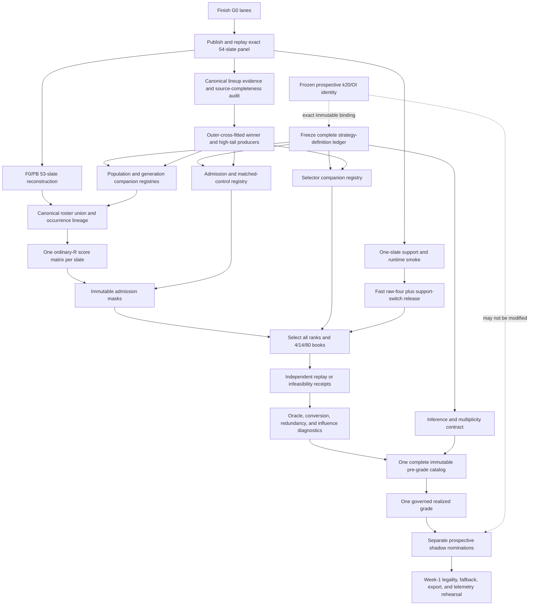

# Pre-Week-1 historical strategy census execution amendment

**Date:** 2026-08-25
**Status:** outcome-blind execution amendment and implementation board
**Applies to:** the Foundry historical corpus-generation, admission, retrieval,
and diagnostic program
**Does not authorize:** a realized-outcome read, production-policy change,
live-process intervention, cloud execution, promotion, or modification of the
frozen prospective k20 shadow

## 1. Operator directive and controlling decision

Regular-season Week 1 is a hard **completion deadline**, not the beginning of
another experiment cycle.

Before the first 2026 regular-season slate:

1. every distinct strategy whose required historical inputs exist must have a
   frozen, versioned scientific contract and implementation;
2. every required historical scope must have either an accepted result or an
   exact mechanical-infeasibility receipt under its frozen law;
3. every feasible final book must be immutable and included in one complete
   pre-grade catalog;
4. the complete catalog must receive one controlled realized grade and
   influence analysis; and
5. the existing prospective k20/OI Week-1 shadow must remain byte-identical.

Implementation delay, deployment inconvenience, missing orchestration, or an
unwritten contract is **not** `DATA_BLOCKED`. Those are implementation gaps and
must be closed before the deadline.

The historical k20 experiment and the prospective k20/OI shadow are separate
objects:

- historical K20 is a required candidate-origin-volume factor in the frozen
  P0/PB factorial;
- prospective k20/OI is an already-frozen live shadow identity; and
- no historical finding may overwrite, mutate, or silently replace that
  shadow. A favorable historical challenger may nominate only a new,
  separately versioned prospective shadow.

This amendment operationalizes:

- `reports/2026-08-24-big-picture-review-response.md`;
- `reports/2026-08-24-foundry-system-big-picture-review-guide.md`;
- `reports/2026-08-24-foundry-completion-and-rapid-experimentation-implementation-plan.md`;
- `reports/2026-08-25-complete-pre-week1-foundry-strategy-census.md`;
- `reports/2026-08-25-pre-week1-historical-experiment-matrix.md`; and
- `reports/2026-08-25-foundry-v12-g0-and-first-t230-smoke-runbook.md`.

When an older roadmap used “Week 1” to mean a future experimentation point,
this amendment supersedes that interpretation. Here and below, Week 1 means
the first 2026 regular-season slate and is the delivery boundary.

## 2. Scope and evidence boundary

This document concerns only:

- how candidate lineups are generated and how the corpus is populated;
- how candidates are admitted to a selector;
- how exact 4-, 14-, and 80-lineup books are selected;
- how those mechanisms are compared historically;
- how winner and high-tail knowledge transfers through outer cross-fitting;
- how mandatory diagnostics distinguish population supply from retrieval
  conversion; and
- how all accepted artifacts join into one immutable grade catalog.

It does not reopen already-closed hypotheses, relax missing-data requirements,
or turn biased discovery frequency into a probability estimate.

The admissible terminal classifications are:

| State | Exact meaning |
|---|---|
| `HISTORICAL_COMPLETE` | Frozen mechanics, all required simulated folds, exact final books, controlled realized grade, and influence report are complete. |
| `HISTORICAL_DIAGNOSTIC_COMPLETE` | A diagnostic or oracle has complete historical measurements but never claimed book or promotion authority. |
| `MECHANICALLY_INFEASIBLE` | The frozen method ran but failed its exact count, support, or compute law; its exact failure receipt is the result and the law was not weakened. |
| `DATA_BLOCKED` | A specifically named historical input, source lineage, field sample, or probability identity does not exist. The missing artifact and collection/remediation action are recorded. |

An implementation may be mechanically ready without being release-ready. A
method name in a registry is not a completed test. Completion requires an
accepted historical book/diagnostic or an exact infeasibility receipt.

The R6-v2 literal terminal maps into this program taxonomy as follows:

```text
R6-v2 complete-source-blocked, accepted=false -> DATA_BLOCKED
```

Its exact literal receipt must remain in the aggregate catalog. It blocks the
matchup-dependent R6 release seam, not the individually runnable matchup-free
selector laws registered elsewhere in this document.

## 3. Non-negotiable invariants

### 3.1 Frozen k20 invariants

Every new census companion and aggregate/pre-grade manifest must bind the
same prospective k20/OI shadow identity by exact URI, generation, SHA-256,
and byte count and must assert all of the following. The already-frozen T230
manifest/authority schema is not rewritten to add this field; its release is
joined under the separately bound shadow-integrity lock at aggregation time.

Before any census companion executes, create and review the tracked authority
envelope at:

```text
reports/corpus-parametric-runs/20260823-foundry-production-v12-panel-index/prospective-k20-oi-shadow-identity-lock-v1.json
```

That lock must retain the actual immutable `2026-cbwu-oi-v1` shadow manifest's
URI, generation, SHA-256, and byte count. It is the sole identity input to the
existing `foundry-prospective-k20-oi-shadow-binding/v1` companion law; a caller
may not substitute an equivalent-looking or current/latest object.

- the historical experiment cannot modify or replace it;
- K20 retains the exact first five registered seed pairs plus the fifteen
  already-frozen prospective pairs;
- R5–R19 are discovery origins only and never become ordinary-R evaluation
  columns;
- candidate-origin stripping remains exact for each heldout R0–R4 block;
- a PB-K20 occurrence cannot make the same roster eligible in PB-K5; and
- additional challengers use K5 unless their origins already exist or an
  explicit companion compute envelope was frozen before effects.

### 3.2 Outcome and fit boundaries

- Generation, admission, and selector fitting may not read the current
  heldout R block.
- Realized outcomes, ranks, payouts, and winner identities may not enter the
  current heldout generation/admission/selection path.
- Outcome-derived F2/F3/hybrid evidence must come from exact outer-cross-fitted
  producer artifacts whose training membership is the complement of the
  heldout slate/season membership.
- Player, team, game, slate, contest, and historical-outcome identities may be
  retained for lineage or audit but not as transferable coefficients.
- All five ordinary R0–R4 blocks contain exactly 10,000 worlds in release
  execution.
- Every selector materializes one deterministic rank 80; N=4 and N=14 are
  exact prefixes of that same rank.

### 3.3 Scientific boundaries

- Every bounded signal admission receives a score/value-blind, size- and
  source/composition-matched neutral control.
- Fill comparisons have equal solve/visit budgets. Unique yield and compute
  efficiency are reported; they are not silently equalized by giving a weak
  arm extra attempts.
- Tail-biased discovery is evaluated on separate ordinary-R worlds. Its visit
  frequency is never reported as target-law probability.
- A simulated effect cannot remove a prespecified method from the realized
  grade.
- No historical result directly licenses a production change.
- The 2023–2025 panel is repeatedly studied retrospective evidence, not fresh
  confirmation. Prospective 2026 pre-lock books remain the confirmation layer.

## 4. Current executable architecture and principal gap

The repository contains a strong immutable substrate, but it is not yet the
complete strategy census execution surface.

### 4.1 What is already frozen

- The canonical v12 source panel has 54 intended accepted slate members.
- The canonical T230 path binds R0–R4 × 10,000, four raw laws, the support
  switch, and exact 4/14/80 books.
- The 53-slate P0/PB × K5/K20 × R194/T230 factorial contract excludes only
  `2025-w01`, whose recovered source lacks R3.
- The core factorial registry contains exactly 18 de-aliased selector or
  diagnostic rows.
- Hard-230 generation and game-regime discovery have frozen pure mechanics,
  matched controls, and a companion manifest.
- Tail-LCB, correlation-aware expected max, hybrid support retrieval, and the
  fixed selector ensemble have frozen pure implementations.
- Maximum-coverage 230 oracle mechanics exist.

### 4.2 What is not yet complete

- `corpus_extreme_tail_factorial_manifest.py` is intentionally a pure schema;
  it does not generate, score, select, publish, verify, or finalize the
  53-slate factorial.
- `corpus_extreme_tail_generation_companion_manifest.py` explicitly declares
  that other complete-census fragments remain required and that it is not the
  final pre-grade catalog.
- The canonical T230 panel worker runs the raw four laws and support switch,
  not the entire current/roadmap selector census.
- The T230 scientific CLI is executable, but its production transport is not
  yet launch-safe: no repository path currently publishes the post-lock,
  digest-pinned image-evidence object and mounts the same secure bytes at the
  required runtime path; no canonical output prefix or numeric compute gate is
  frozen; and no durable no-list receipt/recovery launcher protects
  create-once worker, verifier, and finalizer identities. These are
  implementation blockers, not data blockers.
- The seven-law R6-v2 panel seam is honestly source-blocked by its retrospective
  matchup source and deliberately has no matchup-free accepted lane.
- Hybrid/ensemble mechanics have no reviewed frozen release source and
  producer authority-lock identities yet.
- F1, F2, F4, the F-negative population ablations, several generation
  schedules, most admissions, and the winner-score proxy lack complete named
  Foundry execution contracts.
- There is no aggregate release that proves every runnable census fragment is
  present before the controlled outcome boundary opens.

The required architectural response is additive companion manifests and one
aggregate join. The frozen eight primary cells and the prospective k20 shadow
must not be expanded into a monolith or rewritten.

The 54-member G0 carrier and 53-member factorial catalog are distinct source
authorities. The factorial adapter must exact-bind the legacy four-block
`2025-w01` recovery member and then mechanically exclude it; it may not
serialize, relabel, or truncate the canonical G0 panel into a substitute
factorial catalog.

## 5. Exhaustive strategy-family ledger

The implementation states below use these labels:

- **EXECUTABLE:** frozen mechanics and a relevant current execution path
  exist;
- **ADAPTER REQUIRED:** scientific mechanics or reusable primitives exist,
  but the complete census panel/release adapter does not;
- **IMPLEMENTATION REQUIRED:** the named census law is not implemented even
  if lower-level ingredients exist;
- **SOURCE-CONDITIONAL:** run every scope whose exact source-completeness gate
  passes and publish missing-source receipts elsewhere;
- **GENUINELY BLOCKED:** a named data/probability identity is absent; and
- **CLOSED:** the exact hypothesis already received a valid close disposition
  and must not be relabeled or rerun.

### 5.1 Population and fill ledger

| ID/family | Required historical test | Testability | Current implementation state | Required closure |
|---|---|---|---|---|
| `F0-incumbent` | Exact production-compatible population control | Runnable | Existing generation engine is executable; new 53-slate reconstruction is **ADAPTER REQUIRED** | Reconstruct once per required origin, bind occurrence/proof lineage, and execute the factorial panel. |
| `PB-frozen-all-boom` | Exact 200-unique all-boom reconstruction at K5 and K20 | Runnable only as historical conversion substrate | Three-lever environment and unique-fill/parity law are frozen; panel execution is **ADAPTER REQUIRED** | Generate P0 and PB under exact shared inputs, require zero shortfall or an infeasibility receipt, retain per-origin parity, and never promote the closed standalone PB money fill. |
| `F1-tail-family` | One fixed equal-solve mixture of incumbent, boom, bounded QB-variant, and role supply | Runnable | Reusable boom/QB/role levers exist; named strategy is **IMPLEMENTATION REQUIRED** | Freeze sleeve shares, solve counts, duplicate policy, legal law, control, and one dose before effects. |
| `F2-winner-support` | Equal-budget identity-free topology sleeves derived from accepted v12 relaxations and cross-fitted winner/control support | Runnable | v12 relaxation candidates and descriptive winner evidence exist; population law is **IMPLEMENTATION REQUIRED** | Reconcile the winner source, build outer-fold topology support, freeze sleeves over stack/bring-back/concentration/salary/ownership shapes, and bind a matched F0 control. |
| `F3-phenotype-conditional` | Cross-fitted soft bonuses/quotas for portable high-tail phenotypes | Runnable | B1/walk-forward prediction mechanics exist; Foundry population integration is **ADAPTER REQUIRED** | Build canonical candidate evidence, exclude identity coefficients, freeze one bonus/quota dose, and exact-bind producer folds. |
| `F4-hybrid` | One fixed mixture of F1, F2, F3, and novelty/residual supply | Runnable after F1–F3 | **IMPLEMENTATION REQUIRED** | Freeze mixture shares before component effects; preserve exact sleeve and solve accounting. |
| `F-negative` | Remove each F4 sleeve separately at equal total budget | Runnable after F4 | **IMPLEMENTATION REQUIRED** | Register one ablation per sleeve, reallocate no removed budget adaptively, and report mechanism effects. |
| `hard-230-generate-replenish-v1` | Continue an ordered generator stream until the paired retained count has a permitted inclusive-230 hit or the exact ceiling is reached | Runnable | Public mechanics, controls, and companion registry are frozen; outer optimizer/panel is **ADAPTER REQUIRED** | Replay the complete generator stream, canonical-roster uniqueness, legality and solver proofs; accept exact count or exact infeasibility. |
| Existing seven v12 rule arms | Incumbent plus six one-factor rule relaxations | Runnable / G0 prerequisite | Current G0 execution family | Finish and publish G0, then expose every arm to the complete selector surface. Do not equate these separate arms with the complete F2 sleeve. |
| PIT ownership/leverage fill | Generate low-owned/high-leverage shapes | **SOURCE-CONDITIONAL** | Historical ownership sources/models exist in part; Foundry fill law is **IMPLEMENTATION REQUIRED** | Freeze a new source-complete law rather than reviving the previously closed weak A4 gate; run passing slates and emit exact missing-source receipts. |
| Corrected matchup fill | Receiver/defender and positional-concession sleeves | **GENUINELY BLOCKED** where PIT reconstruction fails | No eligible complete source seam | Require generation-pinned point-in-time matchup features and completeness; do not use retrospective rows. |
| Duplication-conditioned fill | Generate toward low estimated duplication | **GENUINELY BLOCKED** where PIT field rosters are absent | No authoritative complete field source | Record exact missing contest/field artifacts; do not infer duplication from ownership alone. |

### 5.2 Candidate-generation and world-schedule ledger

| Method | Required matched test | Testability | Current implementation state | Required closure |
|---|---|---|---|---|
| Current exact world optimum | Incumbent one-optimum-per-visit control | Runnable | **EXECUTABLE** in the current carrier | Preserve exact solver, legality, visit order, and proof lineage. |
| Top-total-world schedule | Existing visit-schedule control | Runnable | **EXECUTABLE** | Retain as the common equal-visit control for schedule challengers. |
| Near-optimal enumeration | Fixed top-K or fixed objective gap, deterministic no-good cuts, equal solver limit | Runnable | Specialized closed Atlas 8×5 code is not this law; **IMPLEMENTATION REQUIRED** | Freeze one generic top-K or gap law. Do not revive achievable-ceiling ranking or Atlas clustering under a new label. |
| Deterministic unique-fill | Continue until exact unique count or frozen compute ceiling | Runnable | Reusable production/PB/hard-230 primitives; census panel **ADAPTER REQUIRED** | Use canonical nine-player roster identity, bind the complete stream, and publish exact shortfall/exhaustion status. |
| Portfolio column generation | Add the legal lineup with greatest marginal uncovered scenario value | Runnable | Exact LR8/residual pricing and no-good mechanics exist; census release **ADAPTER REQUIRED** | Version an ordinary-R K5 companion with fixed iteration/solver budget and separate control. |
| Game-regime-stratified discovery | Equal round-robin visits across simulated game regimes | Runnable | Frozen schedule/accounting/heldout mechanics; **ADAPTER REQUIRED** | Attach the incumbent optimizer, exact paired visit/solve control, solver proofs, and 53-slate release. |
| Residual-event targeted discovery | Iteratively visit scenarios left uncovered by the source pool | Runnable | Residual-world primitives exist; **ADAPTER REQUIRED** | Separate the world-schedule treatment from column pricing, freeze visit update law, and evaluate on ordinary heldout R. |
| Block-balanced discovery | Equal visits across ordinary R blocks before deterministic remainder | Runnable | Reusable block-stratified primitives; **ADAPTER REQUIRED** | Register a standalone schedule identity and exact allocation/receipt law. |
| Deterministic mixed schedule | One fixed share of top-total, game-regime, residual, and block-balanced visits | Runnable | **IMPLEMENTATION REQUIRED** | Freeze shares and remainder order before component effects; no share sweep. |
| Slate-total quantile strata | Equal visits across frozen slate-total quantiles | Runnable | **IMPLEMENTATION REQUIRED** | Freeze quantile edges/assignment/ties from training worlds and use an equal-visit control. |
| Achievable-lineup-ceiling/Atlas schedule | Previously tested ceiling-ranked world schedule | **CLOSED** | Exact minimal test lost its preregistered comparison | Do not rerun, expand, or relabel. |
| Top-nine/position ceiling proxy | Proxy for the same ceiling-ranking hypothesis | **CLOSED** | Same closed family | Do not rerun or treat as near-optimal enumeration. |
| True importance-sampled T worlds | Target/proposal sampling with likelihood ratios | **GENUINELY BLOCKED** | Exact validated `p/q` identity absent | Require target/proposal densities, normalized weights, ESS/variance law, and independent replay before use. |
| Probability-preserving rare-event splitting | Weighted splitting with levels and genealogy | **GENUINELY BLOCKED** | Probability and verifier contracts absent | Require target-mass preservation, branching/resampling genealogy, variance law, synthetic truth, and independent replay. |
| Regime-mixture/heavy-tail/t-copula worlds | One alternative simulator release | **GENUINELY BLOCKED** | PIT calibrated mixture/dependence release absent | Require marginal preservation and heldout-season joint-tail/proper-score improvement before a world release. |

Portfolio column generation and residual-event scheduling may share code but
are distinct scientific interventions. The former changes which lineup is
priced next; the latter changes which scenarios receive visits. Each requires
its own ID, control, and trace.

### 5.3 Admission ledger

| Admission | Required test | Testability | Current implementation state | Required closure |
|---|---|---|---|---|
| Complete fold-eligible union | Canonical no-quota control | Runnable | **EXECUTABLE** on the T230 path | Reuse unchanged on every common substrate. |
| Fill-specific pool | Preserve a source population while comparing selectors | Runnable | Masks/contracts exist; factorial execution **ADAPTER REQUIRED** | Bind exact population/mask membership and compare selectors on identical admitted IDs. |
| Neutral matched control | Score/value-blind size/source/composition control for every signal admission | Runnable | Generic R6 and two-generation control primitives exist; universal census registry **ADAPTER REQUIRED** | Build one target-bound neutral receipt per admission and freeze the dose after mechanics-only benchmarking. |
| `training-hit-ge-230-admission-v1` | Require a permitted fit-world inclusive-230 hit, then run the unchanged support switch | Runnable | Frozen mechanics and core registry row; panel **ADAPTER REQUIRED** | Publish exact 4/14/80 books or no-book infeasibility when fewer than 80 survive. |
| Simulated-tail/block-support gate | Frozen opportunity and distinct-block support filters | Runnable | Retrieval support mechanics exist, but admission is **IMPLEMENTATION REQUIRED** | Keep candidate gating separate from selector support-switch policy; freeze thresholds once. |
| Cross-fitted realized-tail posterior | Outer-cross-fitted portable phenotype shortlist | Runnable | Prediction/producer primitives exist; **ADAPTER REQUIRED** | Produce exact heldout-complement vectors and pair with neutral admission. |
| Winner-support topology | Cross-fitted same-slate winner-versus-control topology shortlist | Runnable | Descriptive evidence exists; **IMPLEMENTATION REQUIRED** | Build source-complete outer-fold producer and identity-free topology score. |
| Boom/source support | Fixed family/source sleeve | Runnable | Source tags exist; **IMPLEMENTATION REQUIRED** | Freeze family membership and dose without outcome-selected tuning. |
| Pareto/dominance pruning | Remove candidates dominated on simulated utility, support, and redundancy | Runnable | **IMPLEMENTATION REQUIRED** | Freeze vector, direction, exact ties, and neutral size/source control. |
| Novelty/residual-scenario support | Reserve a fixed shortlist sleeve for uncovered signatures | Runnable | Composite selector can consume a vector; producer/admission **IMPLEMENTATION REQUIRED** | Define novelty universe and outer-fit signature before selection. |
| Incumbent-reserve mixture | Fixed minimum incumbent representation plus challenger sleeves | Runnable | **IMPLEMENTATION REQUIRED** | Freeze minimum share, sleeve order, shortfall, and deterministic supplement. |
| PIT ownership/leverage support | Pre-lock ownership/leverage sleeve | **SOURCE-CONDITIONAL** | Foundry admission law absent | Run exact-complete slates only; missing-source receipts elsewhere. |
| Corrected matchup support | Receiver/defender advantage plus completeness | **GENUINELY BLOCKED** where PIT seam fails | R6 legacy snapshot is retrospective/mechanics-only | Do not let the source-blocked matchup path delay matchup-free selectors. |
| Duplication/payout support | Field-roster and duplicate-aware admission | **GENUINELY BLOCKED** where field rows are incomplete | Complete authoritative field source absent | No payout or field-relative claim from winner rows alone. |

Every admission receipt must retain the complete admitted and excluded
partition, exact candidate source/mask identity, discarded-opportunity
diagnostic, dose, neutral-control identity, and false outcome/promotion
authority.

### 5.4 Retrieval and portfolio ledger

The same scientific law appears only once. Population, admission, fit scope,
or implementation identity does not create a new selector alias.

#### Frozen/current core registry

| Strategy ID | Role | Testability | Current implementation state | Required scope |
|---|---|---|---|---|
| `coverage-194-v1` | Incumbent inclusive-194 set coverage | Runnable | Frozen/executable | Canonical v12 and all four P×K substrates; canonical alias only. |
| `coverage-ge-230-v1` | Inclusive-230 marginal event coverage | Runnable | Frozen/executable | Canonical v12 and all P×K substrates. |
| `bounded-tail-ladder-ge-210-250-v1` | Finite 1/2/4/8/16 set-coverage ladder | Runnable | Frozen/executable | Canonical v12 and all P×K substrates. |
| `block-robust-bounded-tail-ge-210-250-v1` | Leximin worst-block finite ladder | Runnable | Frozen/executable | Canonical v12 and all P×K substrates; support-switch fallback. |
| `individual-ge-230-rank-v1` | Individual inclusive-230 rate without set diversification | Runnable | Frozen/executable | Canonical v12 and all P×K substrates. |
| `frozen-census-support-switch-ge-230/v1` | Prespecified support-gated raw-law switch | Runnable | Frozen/executable | Primary T230 factorial contrast; never chosen from observed effect. |
| `support-switched-event-component-tickets-ge-230-v1` | Deterministic tail-event component tickets | Runnable | Frozen mechanics; factorial panel adapter required | All P×K substrates; mandatory F2 interaction. |
| `individual-training-maximum-rank-v1` | Anti-diversification upper-end ablation | Runnable | Frozen mechanics; panel adapter required | Canonical and P×K. |
| `training-hit-ge-230-admission-v1` | Admission sensitivity followed by support switch | Runnable | Frozen mechanics; panel adapter required | Canonical and P×K; counted once as an admission mechanism. |
| `strict-200-coverage-v1` | Strict-above-200 coverage comparator | Runnable | Frozen/executable | Canonical and P×K. |
| `tail-ladder-200-210-220-v1` | Existing strict finite shoulder ladder | Runnable | Frozen/executable | Canonical and P×K. |
| `mean-score-v1` | Negative control | Runnable | Frozen/executable | Canonical and P×K. |
| `expected-max-v1` | Ordinary greedy expected maximum | Runnable | Frozen/executable | Canonical and P×K. |
| `block-supported-tail-ladder-v1` | Existing distinct-block-supported shoulder ladder | Runnable | Frozen/executable | Canonical and P×K. |
| `regime-robust-ladder-v1` | Existing shoulder-regime leximin ladder | Runnable | Frozen/executable | Canonical and P×K. |
| `convex-excess-expected-max-ge-200-v1` | One fixed `max(0,s-200)^2` set utility | Runnable | Frozen mechanics; release adapter required | Canonical and P×K; no exponent/threshold sweep. |
| `block-supported-bounded-tail-ge-210-250-v1` | 230-native distinct-block-support-scaled ladder | Runnable | Frozen mechanics; release adapter required | Canonical and P×K. |
| `maximum-coverage-ge-230-oracle-diagnostic-v1` | Exact/bounded maximum-coverage conversion gap | Runnable diagnostic | Frozen mechanics; diagnostic panel required | N=4, N=14, bounded N=80; never a book nominee. |

The core registry remains exactly 18 rows: 17 selector/admission mechanisms
and one oracle diagnostic. The full T230 execution path currently covers only
the raw four and support switch. An additive selector execution companion must
run the rest without changing the core registry.

#### Remaining runnable retrievals

| Strategy ID/family | Exact one-method test | Testability | Current implementation state | Required closure |
|---|---|---|---|---|
| `tail-lcb-ge-230-v1` | Fixed exact-binomial lower-bound whole-rank choice with prespecified calibration law | Runnable | Frozen pure mechanics; standalone nonpublication receipt | Add exact source/panel release and aggregate-catalog fragment. |
| `correlation-aware-expected-max-ge-230-v1` | Marginal expected-max gain minus exact inclusive-230 overlap-rate penalty | Runnable | Frozen pure mechanics; standalone nonpublication receipt | Add exact source/panel release and all required substrate books. |
| `hybrid-support-retrieval-v1` | Four fixed 20-lineup sleeves followed by frozen set objective | Runnable after support producers | Frozen mechanics; release authority locks absent | Freeze reviewed source and producer locks, then run exact outer-fold receipts. |
| `fixed-selector-ensemble-v1` | Fixed equal-weight Borda over four public selectors | Runnable | Frozen mechanics; release authority locks absent | Exact-replay all four source ranks; no missing-source renormalization. |
| Winner-score threshold proxy | Walk-forward PIT slate-context threshold from prior winner rows | **SOURCE-CONDITIONAL** | **IMPLEMENTATION REQUIRED** | Reconcile winner registry, freeze source-completeness gate and predictor, outer-fit by time, and label only as winner-score proxy. |
| True slate-conditional field-max expected max | Full-field maximum distribution | **GENUINELY BLOCKED** | Historical PIT field universe/model absent | Do not substitute winner score for a field-max distribution. |
| Duplication-adjusted expected payout | Payout net of ties/duplicates | **GENUINELY BLOCKED** | PIT field/duplication rows incomplete | Require full field, ownership, payout, tie, and duplication model. |

The rejected unbounded/steep 200–240 ladder family remains **CLOSED**. The
fixed convex-excess law and finite bounded ladder are its allowed bounded
comparators, not permission to reopen a utility sweep.

### 5.5 Mandatory diagnostics

Diagnostics cannot nominate a book, but the historical program is incomplete
until every feasible item below has an accepted diagnostic receipt:

1. maximum-coverage inclusive-230 oracle at exact N=4 and N=14 and bounded
   N=80, including incumbent lower bound, solver upper bound, gap, node budget,
   and proof identity;
2. 194/200/210/220/230/240/250 population opportunity, book hit, conversion,
   conditional regret, and `C-S` gap;
3. event-union breadth, intersection/Jaccard, duplicate event signatures,
   packed-event rank, and score-vector correlation;
4. internal game/topology concentration versus cross-lineup event overlap;
5. 230+ versus same-slate 190–210 portable phenotype contrast;
6. winner/top-scorer receiver-defender and positional-concession completeness,
   with non-PIT rows excluded from selection;
7. GPD/peaks-over-threshold and simulated-versus-realized tail mismatch as
   descriptive sensitivity only;
8. tail-dependence coefficients and variograms clustered by slate/season;
9. universal five-player/65-point narrative prevalence as descriptive
   evidence, never a new hard mandate;
10. leave-one-slate, leave-one-season, block influence, and cross-fit
    stability; and
11. runtime, peak memory, solver calls, visits, duplicate yield, shortfall,
    exact source hashes, and deterministic replay status.

## 6. Dependency graph



The fast T230 path and complete historical path run in parallel. The fast path
does not wait for every generation arm. The realized grade does.

## 7. Generate once, score once, select many

No experiment should require a new deployment or a new matrix build merely
because a selector parameter changed.

For each slate:

1. exact-replay the source member, player universe, legality law, ordinary-R
   worlds, and generator implementation;
2. generate every registered population once under its frozen origin and
   compute law;
3. retain every occurrence, canonical roster hash, source family, origin
   block, solver/legality proof identity, duplicate, and shortfall;
4. deduplicate by canonical nine-player roster while preserving all occurrence
   lineage;
5. create one deterministic global roster union;
6. score each unique roster once against the shared R0–R4 matrix;
7. derive each population, origin, cross-fit, and admission mask from immutable
   lineage;
8. run every applicable selector against those masks without regenerating or
   rescoring candidates; and
9. retain one deterministic rank 80 plus exact 4/14/80 prefixes.

The already-frozen T230 release binds its score-matrix identity but does not
persist reusable matrix bytes. Do not reopen that cleared implementation only
to retrofit storage. The complete-census substrate may perform one explicitly
grandfathered reconstruction, independently verify it, persist the accepted
score rows, and require every later admission/selector companion to reuse
those rows. After that substrate release, no method may rescore the same
canonical roster/source/world identity.

Two representations remain scientifically necessary and are not duplicate
scoring: the little-endian `<i8` milli-DK player-by-world source matrix used by
generation laws, and the C-contiguous native `float64` lineup-by-world view
required by the frozen selectors. Their derivation and shared source identity
must be exact-bound.

The artifact tree should be content-addressed and generation-pinned:

```text
source catalog
  -> source member / carrier / player registry / R0..R4 worlds
  -> population occurrences and solver proofs
  -> canonical global roster union
  -> one all-five ordinary-R score matrix
  -> cross-fit candidate masks
  -> admission partitions and matched controls
  -> selector traces and rank-80 receipts
  -> exact 4/14/80 books
  -> per-slate acceptance or infeasibility receipt
  -> panel completion
  -> aggregate pre-grade catalog
  -> controlled grade
```

Latest/current/list object reads are forbidden. Every retained reference uses
exact URI, generation, SHA-256, and byte count. Create-once collision with
different content is a hard stop.

The G0 panel publisher may idempotently reopen an equal-byte object under its
own frozen law. The current T230 exact-create-once store does not: until the
planned identity-bound recovery seam is implemented, **every** T230 collision,
including equal bytes, is terminal and no T230 command may be rerun
automatically.

## 8. Historical experiment surfaces

### 8.1 Stage A — shared selector surface

Run every selector law on:

- the accepted 54-slate v12 union where its source requirements pass; and
- all four P×K substrates on the 53-slate factorial surface:
  `P0-K5`, `P0-K20`, `PB-K5`, and `PB-K20`.

This is selector work over shared matrices. It does not license regenerated
candidate pools.

### 8.2 Stage B — one-factor A/B/C/D surface

Every population, generation schedule, or admission challenger first receives
the same four cells:

| Cell | Population/admission | Retrieval | Purpose |
|---|---|---|---|
| A | control | `coverage-194-v1` | common baseline |
| B | challenger | `coverage-194-v1` | population/admission supply effect under incumbent retrieval |
| C | control | support-switched T230 | retrieval-only effect |
| D | challenger | support-switched T230 | joint effect and conversion interaction |

Required contrast decomposition:

```text
population/admission effect under R194 = B - A
retrieval effect on control            = C - A
joint challenger effect                = D - A
interaction                            = (D - B) - (C - A)
```

Generation is shared between B and D. K5 is the universal discovery dose.
K20 remains mandatory only for the frozen P0/PB volume factorial and already-
frozen origins unless a separate pre-effect compute manifest explicitly binds
another K20 treatment.

### 8.3 Stage C — mandatory prespecified interactions

Run these even if their one-factor simulated result is unfavorable:

1. PB all-boom × support-switched T230;
2. hard-230 generation × support-switched T230;
3. F2 winner-support × scenario-component tickets;
4. F3 phenotype admission × hybrid-support retrieval; and
5. deterministic mixed discovery × 230-native block-supported retrieval.

No post-effect interaction may be added to the controlled grade. New ideas
after definition lock become separate exploratory or prospective work.

### 8.4 Stage D — one controlled grade

The controlled realized boundary remains closed until every registered row is
one of:

- exact final books accepted and included;
- diagnostic receipt accepted and included;
- exact mechanical-infeasibility receipt accepted and included; or
- exact named missing-source receipt recorded for a source-conditional or
  genuinely blocked scope.

Then grade the complete catalog once. Report every method, not only the best.

## 9. Required receipts and acceptance model

### 9.1 Definition and runtime receipts

Before execution, freeze:

- strategy contract and independent literal hash;
- implementation contract, dependency bytes/callables, runtime versions, and
  immutable image or exact local implementation identity;
- source catalog and ordered membership acceptance;
- panel/source commit and output prefix;
- ordinary-R block and world-dose law;
- entry budgets and prefix law;
- exact compute ceiling, visits, solver calls, seeds, and tie rules;
- neutral-control law;
- k20/OI shadow identity and non-mutation assertions; and
- deterministic result, verification, acceptance, and completion URIs.

### 9.2 Per-slate generation receipts

Each population/schedule receipt retains:

- exact input member and source identities;
- generator strategy/implementation/configuration identities;
- ordered visits and solver requests;
- every solver/optimality/legality proof identity;
- canonical roster hashes and all source/origin occurrences;
- attempts, solves, unique retained count, duplicates, and shortfall;
- paired-control identity and exact budget parity; and
- release or fixture mode, with fixture authority always false.

### 9.3 Matrix and admission receipts

Each matrix/admission receipt retains:

- ordered lineup IDs and canonical roster identities;
- little-endian integer score-matrix encoding and exact shape;
- all-five R0–R4 matrix identity and fit-scope slice derivation;
- population, origin, cross-fit, and admission masks;
- complete admitted and excluded partitions;
- target and matched-neutral admission identities; and
- proof that no heldout/current outcome column was present.

### 9.4 Selector and book receipts

Each selector receipt retains:

- strategy and implementation identities;
- exact candidate/admission/matrix/fit-scope bindings;
- all marginal trace values, ties, supplements, and infeasibility law;
- one prefix-stable rank 80;
- exact books at 4, 14, and 80;
- support-switch raw ranks and chosen-policy proof where applicable; and
- false outcome, publication, promotion, decision, and production authority.

### 9.5 Mechanical-infeasibility receipts

An infeasibility receipt must bind the same contract and inputs as a success
and state the exact failed law, such as:

- fewer than 80 eligible/admitted candidates;
- hard-230 retained-count shortfall at the fixed ceiling;
- schedule quota infeasibility;
- solver proof failure or timeout within the fixed envelope;
- missing exact book at any supported budget;
- matrix/source/occurrence replay mismatch; or
- peak-memory/runtime envelope breach.

It may not lower a threshold, change a dose, increase a ceiling, borrow heldout
candidates, or supplement from an unregistered population after failure.

### 9.6 Independent verification and panel completion

Workers publish nonterminal results. A distinct verifier process exact-replays
authoritative inputs and recomputes the scientific result before it publishes
acceptance. The panel finalizer exact-reopens every ordered result and
acceptance, checks complete membership and unique identities, and publishes
only when every expected member has one accepted terminal disposition.

## 10. Inferential and multiplicity plan

### 10.1 Estimands

For each population `U`, selected book `B`, entry budget
`N in {4,14,80}`, and threshold
`t in {194,200,210,220,230,240,250}`, retain:

```text
C_t(U) = ordinary-R or realized indicator that max(U) >= t
H_t(B) = ordinary-R or realized indicator that max(B) >= t
S(B)   = weekly maximum score of B
gap    = max(U) - S(B)
conversion_t = H_t(B) / C_t(U), when C_t(U) > 0
```

The primary mechanism estimands are paired per-slate changes in:

1. weekly maximum `S`;
2. inclusive-230 transition probability;
3. 230 opportunity-to-book conversion; and
4. the prespecified A/B/C/D interaction.

The neighboring thresholds are mandatory context, not optional favorable
substitutes for 230.

### 10.2 Inferential unit

- Average the five heldout-fold results into one equal-weight vector per
  slate.
- Slates, not worlds, folds, candidates, or lineup-world events, are the
  inferential unit.
- Report paired slate effects, season-stratified summaries, and distributions,
  not only grand means.
- Use exact sign-flip inference where enumeration is feasible; otherwise use
  one preregistered fixed-seed Monte Carlo sign-flip procedure.
- World-level confidence intervals are forbidden.

### 10.3 Multiplicity

The enlarged census requires an explicit policy before the grade:

1. group primary comparisons into five prespecified families: population/fill,
   generation/schedule, admission, retrieval, and mandatory interactions;
2. within each family, compute a simultaneous max-absolute-statistic sign-flip
   reference distribution across every primary contrast and N=4/14/80;
3. report raw and family-wise adjusted probabilities/intervals;
4. apply Holm adjustment to the seven nested threshold-transition/McNemar
   comparisons within each strategy × N report;
5. report effect sizes and intervals even when adjusted evidence is weak;
6. do not choose a favorable threshold, budget, season, or model after the
   grade; and
7. label cross-family ranking exploratory. Prospective 2026 shadows supply the
   confirmation step.

If the exact implementation uses one global max-statistic family instead, that
more conservative choice is acceptable only if frozen before the outcome
read. Silent absence of multiplicity control is not acceptable.

### 10.4 Stability and interpretation

Every verdict travels with:

- leave-one-slate influence;
- leave-one-season influence;
- block breadth and worst-block performance;
- training-to-heldout simulated gap;
- exact source-support counts;
- compute/yield accounting;
- all neighboring thresholds; and
- explicit retrospective, diagnostic, or prospective evidence class.

A few 230 clears cannot alone establish a reusable edge. A promotion nominee
must show a coherent weekly-maximum/conversion effect, reasonable season and
block transfer, and an operationally legal prospective shadow/fallback.

## 11. Fast path and parallel companion tracks

### 11.1 Fast score path

The fast path remains:

1. finish the two original G0 controllers without a second controller;
2. finish each lane once;
3. validate and create-once publish the combined 54-slate panel;
4. run the frozen 2023-w01 support/runtime smoke;
5. freeze/review/commit the real G0 authority lock;
6. freeze the canonical T230 output prefix and numeric runtime/RSS gate, then
   close the post-lock image-evidence build/mount, durable receipt ledger,
   two-lane launcher, and no-list recovery seam;
7. prepare and run the four-law T230 worker/verifier panel; and
8. publish the canonical support-switch release when operational, runtime,
   replay, and completeness gates pass. A valid
   `joint_support_boundary_passed=false` is still published: it freezes the
   bounded fallback rather than failing the release.

This path does not wait for F1–F4 or later schedules. It supplies the first
outcome-blind score artifacts and the common source substrate.

### 11.2 Definition-lock rule before effect inspection

There is no exploratory exception at this gate:

- the one-slate smoke and canonical ordinal-0 benchmark may inspect only
  runtime, peak memory, exit/replay status, and other mechanics-only evidence;
- the complete 54-slate T230 `finish-panel` release, including its frozen
  census-bound support conclusion, must exist before any selector rank, book,
  support observation, or comparative effect is inspected;
- the complete census definition ledger must also be frozen first: IDs, exact
  one-method definitions, doses, controls, compute envelopes, interactions,
  source-conditional laws, and multiplicity policy; and
- the governed realized grade remains closed until every final book is
  immutable in the aggregate catalog.

### 11.3 Parallel companion tracks

After G0, use independent non-overlapping work tracks:

| Track | Deliverable | Does not wait for |
|---|---|---|
| S — selector release | Core 18 execution plus tail-LCB, correlation-aware, hybrid, ensemble, conditional winner proxy, and oracle fragment | New population generation |
| E — evidence producers | Canonical lineup features, winner reconciliation, high-tail/winner outer-cross-fit producers, ownership/matchup completeness receipts | Selector execution |
| P — populations | F0/PB reconstruction, F1–F4, F-negative, hard-230, source-complete ownership | Later selector effects |
| G — schedules/generators | Near-optimal, unique-fill, column generation, game-regime, residual, block-balanced, mixed, quantile | F3/F4 model completion where unrelated |
| A — admissions | Every bounded admission and target-bound neutral control | New selector effects |
| C — catalog/statistics | Fragment schema, exact disposition join, inference/multiplicity implementation, final grade manifest | Heavy population completion, until final join |

Every track consumes the same immutable source/member/matrix conventions and
publishes a separately versioned fragment. No track edits the core eight-cell
manifest or prospective k20 shadow.

## 12. Aggressive execution order and critical path

The ordering below prioritizes score production and 230-supply mechanisms
without screening any strategy out of the final grade.

### Planning day 0–1: unblock the common substrate

1. Complete G0, panel publication/replay, and the one-slate support/runtime
   smoke.
2. Freeze the complete strategy-definition ledger and multiplicity contract.
3. Freeze the T230 output prefix and compute gate; close its image-evidence,
   durable-ledger, recovery, and two-lane production transport; then begin the
   raw-four/support-switch T230 release.
4. In parallel, create the selector, evidence, population/generation,
   admission, and aggregate companion skeletons.
5. Audit exact winner, ownership, matchup, and field-source completeness
   without reading governed evaluation outcomes.

### Planning day 1–3: freeze adapters and doses

1. Close the 53-slate factorial worker/verifier/finalizer seam.
2. Close outer optimizer adapters for hard-230 and game-regime generation.
3. Integrate tail-LCB/correlation-aware and freeze hybrid/ensemble release
   locks and producers.
4. Freeze F1/F2/F3 definitions, then F4 and F-negative mixtures.
5. Freeze near-optimal, residual/column, block-balanced, mixed, and quantile
   contracts.
6. Use one prespecified mechanics slate to freeze runtime/compute dose and
   matched-control size. Do not inspect comparative effects for dose choice.

### Planning day 2–7: generate and score shared artifacts

Run the heaviest/highest-direct-tail-supply work first, while all remaining
arms continue in parallel:

1. mandatory P0/PB K5/K20 reconstruction;
2. hard-230 generation;
3. residual-world portfolio column generation;
4. F1 tail-family and F2 winner-support;
5. game-regime and residual-event discovery;
6. near-optimal, block-balanced, quantile, and deterministic mixed schedules;
7. F3 phenotype, F4 hybrid, and F-negative ablations after producer freezes;
8. source-complete ownership/leverage arms; and
9. every corresponding control.

Persist populations once, form one canonical union/matrix per slate, and make
selector execution consume those immutable artifacts.

### Planning day 3–8: select all books

1. Run the complete selector surface on canonical v12 and all P×K matrices.
2. Run A/B/C/D surfaces for every F/G/A challenger.
3. Run the five mandatory interactions.
4. Publish exact infeasibility receipts immediately when a frozen law cannot
   satisfy its contract; do not tune and rerun the science.
5. Run bounded oracle and conversion/redundancy/support diagnostics.

### Planning day 8–10: verify and freeze the catalog

1. Independently replay every per-slate result and acceptance.
2. Finalize each complete panel/companion fragment.
3. Reconcile expected versus observed strategy/scope cardinality.
4. Require one explicit disposition for every census row and required slate.
5. Freeze the aggregate pre-grade catalog and its exact object identities.
6. Prove the prospective k20/OI shadow identity is unchanged.

### Planning day 10–11: grade and operationalize

1. Acquire the governed outcome lease once.
2. Grade every cataloged book and diagnostic once.
3. Run paired, multiplicity-adjusted, season and influence analyses.
4. Nominate new prospective shadows or explicit no-nomination dispositions.
5. Rehearse Week-1 legality, exact 4/14/80 prefixes, fallback, CSV export,
   telemetry, rollback, and post-settlement collection.

These are planning-day targets, not authority to start cloud work. The schedule
is feasible only through parallel companion lanes, shared generation/matrices,
and no redeploy-per-strategy cycle. A frozen compute ceiling that proves a
method infeasible is a valid completed historical test; silently omitting an
unfinished runnable method is not.

## 13. Hard stops

Stop acceptance or the outcome boundary if any of the following occurs:

- the G0 panel is not exactly complete and generation-pinned;
- a strategy ID, implementation hash, source member, matrix, occurrence mask,
  or output identity drifts;
- the k20/OI prospective shadow identity differs;
- any required runnable census row is absent from the definition ledger;
- a bounded admission lacks its target-bound neutral control;
- worker and verifier do not provide distinct, replayable execution identities;
- the T230 image evidence is not digest-pinned and byte-identical at its remote
  and secure runtime locations, or a create-once execution lacks durable
  receipt transport and deterministic no-list recovery;
- heldout/current outcome evidence leaks into generation, admission, fitting,
  ties, or supplementation;
- a selector lacks exact 4/14/80 prefixes;
- a generation arm changes its visit/solve budget after observed effects;
- a tail-biased schedule is interpreted as probability without valid weights;
- an infeasible arm weakens its threshold, count, or ceiling;
- a source-conditional method silently drops incomplete slates without exact
  receipts;
- the aggregate catalog is missing a feasible book, diagnostic, or terminal
  disposition; or
- any method is removed because its simulated effect is unfavorable.

## 14. Definition of done

The pre-Week-1 historical program is complete only when all statements below
are true:

### Platform and source

- [ ] G0 is accepted and the exact 54-member combined panel is published and
      independently replayed.
- [ ] The canonical raw-four/support-switch T230 release is accepted.
- [ ] The 53-slate factorial source membership and 2025-w01 exclusion are exact.
- [ ] Every source-conditional method has a complete passing-slate registry and
      exact missing-source receipts elsewhere.

### Strategy completeness

- [ ] Every `RUN BEFORE WEEK 1` population/fill row has a versioned contract and
      implementation.
- [ ] Every runnable generator/world schedule has a versioned contract and
      implementation.
- [ ] Every runnable admission has its own target-bound neutral control.
- [ ] Every current and roadmap selector has a versioned contract,
      implementation, and required scope registry.
- [ ] Every genuinely blocked and closed row has its exact non-runnable
      disposition and is not relabeled.

### Historical execution

- [ ] The eight primary P0/PB × K5/K20 × R194/T230 cells are complete.
- [ ] Every selector has exact folds and final fits on every required
      substrate.
- [ ] Every F/G/A challenger has its A/B/C/D surface.
- [ ] The five mandatory interactions are complete.
- [ ] Every feasible rank produces exact 4/14/80 books.
- [ ] Every infeasible scope has an exact replayable receipt.
- [ ] Every mandatory diagnostic has an accepted diagnostic receipt.

### Grade and interpretation

- [ ] One immutable aggregate catalog proves all required books, diagnostics,
      and terminal dispositions existed before outcome access.
- [ ] The multiplicity and influence plan is frozen before the grade.
- [ ] One controlled realized grade covers the entire catalog.
- [ ] Paired per-slate, season, leave-one-slate, leave-one-season, neighboring-
      threshold, and adjusted family results are published.
- [ ] Results are labeled retrospective rather than fresh confirmation.

### Week-1 safety

- [ ] The prospective k20/OI shadow is byte-identical to its prior frozen
      identity.
- [ ] Every favorable challenger has a separately versioned prospective
      shadow, legal export, deterministic fallback, telemetry, and rollback
      packet, or an explicit no-nomination disposition.
- [ ] The Week-1 4-entry and 14-entry books are exact prefixes of their frozen
      ranks and are not inferred from exact-80 performance alone.
- [ ] No historical artifact grants automatic promotion or production-policy
      authority.

Until every applicable box is satisfied, the complete offseason Foundry
strategy search is not finished.

## 15. Immediate next implementation actions

The next agent should preserve the fast G0/T230 path and work in this order:

1. close the narrow T230 production transport: freeze its prefix and numeric
   compute gate; build/publish/mount noncircular digest-pinned image evidence;
   and add a durable two-lane receipt ledger plus deterministic no-list
   recovery for partial create-once operations;
2. create the complete definition-ledger/aggregate-fragment schema with an
   exhaustive expected-ID and expected-scope census;
3. implement the 53-slate factorial worker/verifier/finalizer around the
   already-frozen core manifest;
4. add a selector execution companion for all core and roadmap laws without
   modifying the 18-row core registry;
5. attach real optimizer adapters and panel execution to the already-frozen
   hard-230 and game-regime components;
6. freeze and implement F1/F2/F3, then F4 and F-negative;
7. adapt existing residual/LR8 and block-stratified primitives into separate
   portfolio-column, residual-schedule, and block-balanced contracts;
8. implement near-optimal, quantile, and mixed schedules;
9. implement the remaining admissions plus target-bound neutral controls;
10. implement the source-conditional winner-score and ownership/leverage paths;
11. close the aggregate catalog, inference, and controlled-grade seam; and
12. rehearse Week-1 shadows without changing the frozen k20/OI object.

This work should use reusable typed manifests and shared execution images. A
supported strategy change should be:

```text
register contract -> freeze manifest -> run -> independently verify -> join catalog
```

It should not require a new deployment, IAM rewrite, or matrix regeneration
for every selector.
