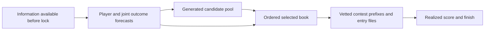

# Better 220+ supply, selection and spreadsheet order

Prepared for Erich and the workstation agent, 2026-09-17. **Research proposal, not an adoption decision or a new result.** No experiment was launched, no entered book changed, and no bank990/991 scientific output read. The accompanying [code review](reviews/2026-09-17-transition-code-review.md) addresses operational correctness separately.

## Assessment

We have learned a great deal, but **we have not established that the useful information or modeling opportunities are exhausted**. The strongest next move is a small diagnostic program that identifies *which errors remain exploitable before lock*, followed by narrowly targeted experiments. Another broad selector sweep or a substantially larger model is not my first recommendation.

Three priorities:

1. Measure conditional forecast quality and selection-induced optimism on independent evaluation worlds. Distinguish predictable ranking mistakes from unavoidable hindsight regret.
2. Test active-but-limited opportunity and role transitions using verified prelock information, above the already-tested participation model. Model how opportunities move between teammates, not just how final fantasy points are rescaled.
3. Improve the quality of small prefixes explicitly, with fresh evaluation and a single narrow portfolio objective comparison. Increasing corpus size alone does not ensure that the first 3, 10 or 30 spreadsheet rows improve.

A fourth, inexpensive avenue is **better allocation of simulation precision**: determine whether ranking instability is caused by Monte Carlo noise before spending more on MILP solves. Importance sampling is a conditional option, not a claim that rare-world generation has never been attempted.

## 1. What the project does, and what the evidence says

Production supplies point-in-time player, usage, market and context data, component projections and calibrated draws. The lab experiments vary candidate generation, joint simulation and book selection. The current Sunday host path uses a pinned lab live implementation with production centering and dual-law expected-max selection; it is not identical to the policy manifest for every production CLI path. A transition must preserve that distinction.

The decision chain is:

Different defects at these stages need different experiments. More candidates cannot repair stale information; more accurate average player scores do not automatically produce better joint tails; better K80 performance does not prove better first-three-row performance.

### Evidence to retain, with its actual scope

| Evidence | What it supports | What it does not establish |
|---|---|---|
| PREREG-035: full-union EMAX +1.515 K80 raw points, positive banks and LOSO; full-union coverage alone null | Selection objective has improved conversion on a particular population | Selection has never worked, or EMAX is universally optimal |
| PREREG-047: D800 versus D400 +1.216 raw; count-matched reference +0.064, null | Extra unique supply was useful in that regime | Every new generator yields better candidates at fixed work |
| PREREG-048: two generation streams at equal work −1.054, every bank negative | More roster novelty was insufficient | Independent audit worlds are harmful; they serve a different purpose |
| PREREG-097: 220+ candidate counts/slate-bank 0.10/0.25/0.45/0.89 at D800/1600/3200/6400 | Larger pools contained more realized high scorers | 0.89 candidates means an 89% chance of a 220 lineup; candidates share players and outcomes |
| PREREG-096: learned K30 reranker −2.83, interval crossing zero, severe season instability | Private-pool learned ranking did not transfer to the tested production-like pool | Every conditional signal or decision-aware learner is useless |
| PREREG-098: top-K by individual P(top-1000)/P(top-100) worsened book finish and raw max | That marginal-probability ranking was harmful | A portfolio probability of *at least one* success was tested and failed |
| PREREG-063/065: participation-aware generation showed a small effect; replication did not pass; point redistribution increased supply without a clear K80 gain | Availability is relevant, but the implemented cascade is unproven | Availability is a new untested idea, or final-points redistribution is the same as forecasting opportunities |
| PREREG-066/067: conditional novelty/rescue did not pass; some small prefixes deteriorated | Arbitrary rescue/coverage can cost the first rows | The added supply has no predictable value under any new information/law |
| PREREG-100: Q+DNP and Q+limited residual problems; undesignated DNP/limited groups were not generally weak | A narrow status interaction merits follow-up | DNP alone is a removal rule or every questionable player should be capped |

Sources: lab [LEDGER.md](https://github.com/espechtsoftware/nfl2/blob/60b7109/LEDGER.md); production [September 16 synthesis](2026-09-16-findings-since-week1-synthesis.md), [briefing](2026-09-14-project-briefing-for-a-new-model.md), and [system-study addenda](2026-07-25-system-study.md). Historical looks are development evidence, including 2025, whose holdout was spent. The three-bank rows do not represent three independent histories of NFL outcomes.

Corrections matter: Addendum 95 explicitly withdrew the claim that no gain was available. The lab later expanded legitimate reopening to a changed implementation, information set, objective or budget, with further allowance for a changed population/representation/search neighborhood. The old hsim spread-sign error narrowed the interpretation of its early nulls; corrected-hsim generation also subsequently failed in PREREG-031/032, while its use as a second selection critic had value. It is not reasonable to cite only the early implementation error as permission to repeat the entire family.

### Claims I would narrow in the current synthesis

“The regret is in the selector's world model, and nowhere else” is stronger than the evidence. There is still irreducible uncertainty, objective mismatch, finite-world estimation error, and possibly heuristic optimization error. Some cohorts and populations differ. A falling probability of retaining the single hindsight-best lineup as the pool grows is not itself a calibrated measure of lost skill.

Likewise, “the one remaining modeling lever” and a proposed universal end to reweighting after one six-bin test are too broad. The defensible claim is that several specific interventions failed, and the current simulator exaggerates some evaluated tails. That is useful evidence, not a proof of an information ceiling.

## 2. Define the product precisely: individual quality and prefix quality differ

Let candidate i score S_i in a shared simulated world. For a book B, define:

* `p_i = P(S_i >= 220)`: a standalone lineup's high-score chance.
* `F220(B) = P(max(i in B) S_i >= 220)`: chance at least one book member reaches 220.
* `M(B) = E[max(i in B) S_i]`: expected best score, close to the present selector's criterion.
* `Ffield(B) = P(max(i in B) S_i >= T(world))`: beating a shared, uncertain contest cutoff.

These are distinct. Example: A and B each have 10% success probability but succeed in exactly the same worlds; C succeeds in a disjoint 9%. Individually A and B rank first, but A+C covers 19% versus A+B's 10%. This is why simply sorting a sheet by per-lineup ceiling or P(top-N) can degrade a book.

For a fixed predictive law, the exact next-row contribution to 220 coverage is

`Delta(i | B) = P(S_i >= 220 AND max(j in B) S_j < 220)`.

This is a weighted coverage function with diminishing returns. Greedy addition is an approximation, not proof that every prefix is the globally best set of that size; optimal sets at different sizes need not nest. The lab already implements coverage/ladder selectors, so this mathematical observation is not a new algorithmic discovery. The genuinely different proposed test below changes the validated law/objective/consumer and evaluates the prefixes actually used.

The DFS literature similarly models opponents and stochastic thresholds, and studies greedy portfolio optimization with submodular structure. It supports distinguishing a portfolio from individually attractive entries; it does not validate our simulator or promise profitability. [Haugh and Singal, *How to Play Fantasy Sports Strategically (and Win)*](https://www.columbia.edu/~mh2078/DFS_Revision_1_May2019.pdf).

**Spreadsheet proposal, initially shadow-only:** retain the operational portfolio rank, and add separate standalone P220, incremental P220, cumulative prefix P220, expected max, uncertainty range, status/source timestamp, and original source rank. All probabilities should be marked experimental until calibrated. Do not imply row 30 is the thirtieth-best standalone lineup. Preserve stable roster identity through vetting, demotion and export so the delivered prefix can be graded, rather than grading a pre-vet book that was not entered.

Evaluate K=3/10/20/30/40/80 plus the exact configured keep counts, recording K=1 for standalone evaluation. Book size 100 applies only when a study actually delivers 100; do not fabricate missing ranks. If combining prefix performance into one objective, freeze nonnegative weights from intended usage before outcomes, rather than optimizing arbitrary weights to past winners. Per-contest duplicated prefixes also change the distinction between unique weekly coverage and contest-level returns.

The user's 220 goal should be prominent in every report. Until a separate objective decision is made, preserve the adopted GLOBAL_WEMAX_PROXY primary and co-report 220, finish and raw maxima. A 220 score is not a fixed payout across slates or contests.

## 3. Separate recoverable errors from hindsight

For one pool C and K entries, let B* be the best K-book under the **true prelock distribution**, and B be our choice. Expected hindsight regret decomposes as:

`E[max(C) S - max(B) S]`

`= E[max(C) S - max(B*) S] + [E max(B*) S - E max(B) S]`.

The first term remains even with perfect information about probabilities: the game has not been played. The second is decision regret. We cannot observe B* from one realized slate. As C grows while K stays fixed, the first term can grow too. Therefore increasing pool oracle minus selected max is headroom for a clairvoyant selector, not a measured amount a learnable selector can recover.

A useful diagnostic splits the second term further, approximately, into forecast-law error, finite-simulation error, and optimization/ordering error. Do this in a synthetic world with a known law first; then use independent audit worlds to measure algorithmic and simulation effects on real frozen pools. Audit worlds remain samples from a model, so they cannot establish that the model matches reality. Actual held-forward outcomes are still essential.

Calibration and discrimination must be measured separately. A constant 5% probability can be calibrated in a population with 5% successes yet have no ranking power. Conversely, a useful ranking can have systematically inflated probabilities. Conditional calibration diagnostics and proper-score decompositions make this distinction explicit. [Gneiting and Resin](https://arxiv.org/abs/2108.03210).

For joint forecasts, report threshold co-exceedance Brier scores on predefined football groups as well as variogram and marginal scores. The energy score alone can be relatively insensitive to correlation errors; variogram scores are more sensitive in the cases studied by Scheuerer and Hamill. Neither by itself certifies our extreme book tail. [Primary paper at NOAA](https://repository.library.noaa.gov/view/noaa/22327).

Do not evaluate prediction quality only on players who later boomed or slates whose oracle exceeded 220. Conditioning the verification sample on the outcome can reward distorted forecasts. Use all eligible rows/slates with predefined threshold-weighted proper scores, and keep winner-only descriptions explicitly descriptive. [Lerch et al., *Forecaster's Dilemma*](https://arxiv.org/abs/1512.09244).

## 4. What more could player data tell us?

There is no supported universal “top five factors” ranking in this review. Feature importance within one fitted model does not measure incremental predictive information, especially with correlated salary, markets, usage and vendor projections. We need grouped, held-forward ablations **against the current served model**, by consumer: mean, tail, dependence, generation and selection.

| Signal family | Specific unresolved question | Proposed representation / falsifier |
|---|---|---|
| Availability and active-but-limited role | Does the practice trajectory predict reduced opportunities among players who are active, beyond P_MIX and the current means? | Prelock state probabilities for out/limited/normal; test conditional opportunity and zero/tail probabilities; stop if no incremental proper-score gain |
| Teammate replacement | Which player inherits routes, carries and high-value work, and is the same team total plausible? | Team-constrained opportunity allocation conditioned on missing roles, personnel history and depth; compare with the existing final-points cascade |
| Opportunity quality | Are two equal-target forecasts different because of route depth, end-zone usage or expected completion/YAC? | Distribution of opportunity types with shrinkage; incremental tail scores over existing route/red-zone/component features, not a duplicate aggregate |
| Game and opponent interaction | Does role × expected coverage/pressure context predict residual tail behavior beyond totals/spreads and existing opponent features? | Very few prespecified interactions, prior games only; test change to tail shape with mean held fixed |
| Market completeness | Is disagreement real, or driven by old/missing lines and mismatched snapshots? | Paired contemporaneous quotes, age, completeness and source agreement; repair measurement before searching for alpha |
| Deployment timing | Does a later validated snapshot improve enough decisions to outweigh a smaller corpus? | Frozen early-vs-late builds at matched compute plus the actual deadline-constrained choice |

Expected fantasy points from opportunity are already a well-developed baseline: public work combines completion probability and expected YAC with target context. Its relevance here is as a component-model comparison, not an unclaimed new signal. [Original implementation/explanation](https://opensourcefootball.com/posts/2020-08-30-calculating-expected-fantasy-points-for-receivers/).

A potentially distinctive direction is **conditional upper-tail opportunity quality**, rather than another player-average efficiency feature. For example, predict a distribution of deep/end-zone targets from prior route role and anticipated opponent behavior, then generate yards and TDs coherently. This is a hypothesis about what remains unpriced, not a finding that matchup features beat the current system.

Tracking research such as *NFL Ghosts* estimates receiver-yard distributions and defender counterfactual positions at the catch. That demonstrates richer within-play distributions are possible. Those current-play positions are not known before a DFS lock: only properly lagged summaries or a separately forecast distribution of future play situations could enter our model. [Yurko, Nguyen and Pelechrinis](https://arxiv.org/abs/2406.17220). Given Addendum 96b's null tracking-trait result and uncertain continuous data access, this is a lower-priority support census, not a recommendation to purchase a feed now.

Point-in-time means **available then**, not merely describing a prior game. nflverse currently documents that participation data from 2023 onward arrives after the postseason, while other datasets have different schedules; depth charts changed to timestamped updates from 2025. A historical file may be unsuitable for an in-season live feature. Search snippets about injury availability were stale relative to the opened current documentation; verify actual provider versions and captured coverage, never assume a search snippet proves present support. [nflverse availability schedule, accessed September 17](https://nflreadr.nflverse.com/articles/nflverse_data_schedule.html).

Collect source publication time, retrieval time, event time, revision and coverage now. A newly discovered information edge cannot be honestly reconstructed from revised end-of-season tables if its prelock availability was not preserved.

## 5. Review of the proposed tail-reweighting study

The [September 16 draft](2026-09-16-prereg-tail-calibration-DRAFT.md) is a reasonable **bounded hypothesis**: pooled simulated pool maxima overstate some extreme-event frequencies; use earlier-season outcomes to tilt world weights and test the resulting book.

I recommend revising the design before its quoted ~$230 rerun:

1. **Fix the clipping contract.** Clipping raw weights to [0.2,2] and then normalizing their mean to 1 does not preserve those bounds. For 99 weights of 0.2 and one of 2, the last normalized weight exceeds 9. Define bounded normalization (or explicitly gate pre-normalized weights) and specify zero-support bins and earliest-season fallback.
2. **Separate fitting, decision and audit worlds.** Estimate weights using prior-season data; select on independent target decision worlds; evaluate simulated book calibration on held-out target audit worlds as well as actual outcomes. Reusing selection worlds can overstate the chosen book's forecast even when the law is correct.
3. **Measure the intervention beyond one scalar.** A weight based on pool maximum can change marginal player means, tails and game exposures. Record these changes and effective sample size; re-centering afterward is another intervention that must be specified, not quietly added.
4. **Address conditioning.** The distribution of the pool maximum depends on slate size, player quality and the generator/dose. Matching six pooled bins does not ensure correct relative probabilities for lineups within each slate. Fit only a very low-dimensional prespecified conditional calibration if justified by prior-season support; do not turn this into a large bin search.
5. **Choose relevant diagnostics.** Per-lineup expected score/AUC is not the same as marginal contribution to Emax or F220. Retain those diagnostics but add prefix-level probability calibration and contribution stability across decision banks.
6. **Use precise consequences.** Failure closes this six-bin world-maximum tilt at this population/dose, not all world reweighting or conditional forecasting. If flat-tail truncation also passes, that alone does not prove equivalence or that calibration is irrelevant; the direct contrast needs uncertainty too.
7. **Price the actual artifact plan.** First establish whether the frozen pool identities and evaluation matrices exist durably. A selector-only replay can avoid expensive solves only if its inputs can actually be recovered. Include training-only 2019 generation, world simulation, RAM, cloud task concurrency and queue occupancy in the estimate. Do not rely on a headline wall-time estimate without the task plan.

The draft's 220 calibration ratios came from a disclosed 65-slate, one-bank diagnostic; replicate the descriptive audit under a frozen plan rather than treating those ratios as immutable population constants. None of these revisions authorizes accessing bank099 outcomes or changing Week 2.

## 6. Next experiments, in execution order

These are draft designs for the owner/operating agent to turn into preregistrations. No proposed numeric threshold below is a post-hoc result. Reuse the standard outcome-disabled mechanics gates, real-artifact smoke, full-path synthetic outcome smoke, pinned input identities and first-reader/cross-reader protocol. Run one bounded experiment at a time, preserving the current bank and Sunday resources.

### E0 — error attribution and independent-world audit (first)

**Question:** Is the apparent ranking problem mostly conditional miscalibration, sampling noise, optimization, or hindsight?

**Inputs:** a prespecified common set of frozen D800 and D3200 candidate pools from completed development cohorts; both laws; strictly prior-season calibration data. Verify artifact availability before promising a no-solve replay. Exclude bank099 entirely. No tuning against 2026 outcomes; already observed Week 1 remains development feedback, not confirmation.

**Design:** select with the existing world count using the incumbent; score the same ordered book on a separate world bank. Repeat with four times the decision-world count at fixed pool, and retain an equal-time control if costs differ materially. First do known-law synthetic experiments with tractable small pools so exact best-K and greedy can be compared. Do not solve an expensive exact real-pool stochastic MILP before that diagnostic establishes a need.

**Read:** per-slate in-bank versus audit-bank expected max/F220, rank and prefix overlap, Monte Carlo error, calibration intercept/slope in a few prespecified prelock strata, and slate-averaged Brier scores at 200/210/220. Report actual proxy/max outcomes once under the frozen analysis. Distinguish all-candidate from selected-prefix reliability. Do not treat millions of candidate/world pairs as independent NFL observations.

**Routing:** if simulated gains vanish on independent audit worlds, prioritize estimator precision (E2). If stable audit gains fail against reality, prioritize conditional law correction (E1 or revised calibration). If the small known-law greedy gap is negligible, stop optimization-algorithm work. If all methods have low discrimination, new information outranks another ranking objective.

**Compute:** no candidate solves if artifacts suffice; otherwise freeze and cost a small reconstruction census first. Chunk candidate-by-world evaluation rather than holding arbitrarily large matrices in RAM. Initial paid screen cap proposed at $5; it may establish runtime/support rather than statistical significance. No large panel automatically follows a support-only screen.

### E1 — active-but-limited opportunity model (highest-priority football hypothesis)

**Hypothesis:** the unresolved signal is not only whether a player participates, but his distribution of routes/carries/high-value opportunities *conditional on being active*. This affects teammates jointly.

**Changed scope:** information representation and generative law. PREREG-063/065/066/067 already tested availability, final-points redistribution and rescue. This study must use a demonstrably new, timestamp-valid practice trajectory/role representation or it is a repeat. Do not rerun a generic questionable-player cap and call it new.

**Minimal arms:** current P_MIX/served law; one hierarchical out/limited/normal opportunity model. Fit state probabilities and conditional role shares with strong partial pooling across positions and prior seasons, allowing only prespecified practice/designation interactions. Allocate team targets/carries first, then scoring outcomes, conserving opportunities and coherent passing/receiving TD relationships. Include no additive fantasy-point handout to beneficiaries. Keep means fixed in one prespecified diagnostic to distinguish distribution-shape effects from mean correction; it is not an additional adoption arm.

**Data gate:** prelock timestamps, healthy controls, outcome support per state/position, unavailable-source missingness and retrospective revisions. No current-week routes, snaps or final active lists before their publication. If historical timestamps cannot support the model, collect prospectively and defer the outcome test.

**Upstream gate:** held-forward opportunity/availability proper scores improve over the existing model; tails improve without unacceptable mean or healthy-player degradation. Freeze an acceptable degradation margin from training-only variability before reading evaluation outcomes. Show stage 1–5 influence and team mass checks.

**Downstream:** start judge-only on shared pools to isolate selection; if its law passes the upstream gate, a subsequent fixed-work generator comparison can test supply. Use current GLOBAL_WEMAX_PROXY and descriptive 220/prefix results. An upstream gain with downstream erasure is a consumer finding, not a reason to silently increase effect size.

**Stop:** no incremental upstream information, missing PIT coverage, or law inconsistency. Initial fit/validation is much cheaper than another D12800 panel; authorize any large simulation panel only after the support and influence gates.

### E2 — reduce tail-estimation noise, without changing beliefs

**Hypothesis:** at least part of unstable prefix ranking comes from estimating tiny marginal gains with too few effective worlds.

For an illustrative probability 0.001 in 20,000 independent worlds, the expected hit count is 20 and relative binomial standard error is about 22%. At probability 0.0001 there are two expected hits and roughly 71% relative error. These are mathematical illustrations, not measured probabilities for this project; concatenated heterogeneous law blocks and correlated sampling change the effective sample size.

**First treatment:** adaptive extra simulation for the small set of close candidate marginal gains, with a separate final audit sample and a hard total runtime budget. Compare with uniform extra worlds at identical wall time, identical candidate pool and unchanged law. If effective candidate differences are much larger than Monte Carlo errors, stop here.

**Conditional second phase:** importance sampling of evaluation worlds using density-known game latents, a defensive base mixture, held-fixed proposal and correct likelihood ratios. Estimate `E_p[h]=E_q[h*p/q]`; reject any proposal missing support, and validate on known-law examples plus brute-force reference estimates. Freeze proposal fitting independently of the final evaluation sample. Report effective sample size, maximum weight and event-specific variance; global ESS alone is insufficient.

Importance sampling can reduce rare-event estimation cost when the proposal and weighting are correct. It cannot supply new predictive information or fix a misspecified target law. [Owen, *Monte Carlo theory, methods and examples*, importance-sampling chapter](https://artowen.su.domains/mc/); [Kroese, Rubinstein and Glynn, *The Cross-Entropy Method for Estimation*](https://www.sciencedirect.com/science/article/pii/B9780444538598000023).

**Changed scope:** PREREG-025 and later CE work proposed worlds for *candidate discovery*. Here the pool is fixed and the target is precision of the *selection estimator*. The existing hsim density machinery is reusable only after verifying that all transformed/mixed distributions have the right weights; a latent proposal does not automatically yield a valid ratio for an arbitrary postprocessed law. Do not apply an unweighted rare-world sample as a new belief distribution.

**Endpoint:** decision/audit agreement and error at matched time first; actual prefix/proxy outcomes only in the single frozen exploratory read. Stop if same-time uniform simulation does as well. This is potentially a compute improvement even without a football-score improvement.

### E3 — calibrated portfolio coverage and ordering (only after E0)

**Question:** with a validated law/precision correction, can we improve the first rows by optimizing the marginal probability of at least one strong outcome?

**Arms:** incumbent DEMAX order versus one greedy portfolio coverage order at 220, both on the identical frozen candidate pool and corrected shared-world estimator. If E0 does not justify a change to the law or estimator, do not repeat coverage merely because the threshold is now 220. Coverage/ladder/novelty have already been tried. Explicitly declare this study's changed scope.

**Evaluation:** current proxy primary at the preregistered book size, plus all listed prefixes, F220 reliability and actual hit weeks. Gate small-prefix damage rather than accepting a K80 improvement that makes the actually kept first rows worse. Include exact configured keep counts in the manifest. Set a noninferiority margin before outcomes; zero permissible harm may be too strict statistically, but selecting the margin after reading is worse.

**Separate follow-up, not another simultaneous arm:** if the corrected law passes and field calibration supports it, optimize the *union* of shared-world top-N events. PREREG-098's individual probability sort is the control mechanism to distinguish, not a portfolio comparator to rename. Use stochastic field cutoffs in the same player-score worlds; preserve player-score/cutoff dependence. Field ownership and duplication error remain extra uncertainties.

**Stop:** no distinct ordering under the influence check, no audit-world gain, or materially damaged important prefixes. Neither raw expected-payout optimization nor a new entered policy is authorized by this report.

### E4 — improve candidate supply per unit of compute (conditional on a better law)

**Hypothesis:** a law that improves conditional opportunity/tail prediction can direct a fixed solve budget to genuinely different success scenarios, rather than merely produce new roster IDs.

**Design:** current stream versus a small replacement portion generated under the validated E1 law, with the same total solve/time budget and identical selector. The replacement proportion must be frozen from an outcome-free runtime/support census, not optimized over historical scores. Report the fixed-unique-count sensitivity once, as required by lab rules.

**Measure:** unique delivered rosters, actual supply counts, the number of slates with any 220 candidate, pool oracle, event-overlap among candidates, and selected-prefix outcome/finish. New candidate count alone is not the objective. A hundred lineups that require the same unlikely player stack to boom may contribute much less coverage than their count suggests.

**Changed scope / avoid repeats:** uniform scenario-covering arrays (PREREG-013), splitting streams (048), deeper no-good solutions and CE generation (025), corrected hsim supply (031/032), and generic relaxed-construction sleeves have all had adverse or context-limited reads. This proposal requires an upstream conditional-law improvement, not a renamed version of those generators. If no new law survives E1, continue the existing dose evidence rather than launch a generator sweep.

**Alternative cheap engineering question:** can warm starts, caching or solver scheduling deliver the same or more useful prefix within the existing deadline? Verify exact legality, stream identity where claimed, and wall-time distributions. A faster valid build is operational value even if its per-candidate scoring law is unchanged.

### E5 — quantify the value of fresh information versus larger stale pools

**Question:** does a smaller, later-informed pool beat a larger earlier pool often enough to change the build schedule or motivate validated local repair?

This directly addresses the operating reality that D12800 takes many hours while status and salaries change near lock. It is not answered by historical dose studies that hold information timing fixed.

**Design:** archive early and late input snapshots with immutable timestamps; freeze shadow books from early-large, late-small and (only if mechanically validated) early-large plus legal fresh-information repair. The comparison needs both a matched-compute view and the actual fixed-deadline view. Capture snapshot age, changed players, source completeness, newly unavailable exposures, retained prefix quality and missed-deadline rate.

**Evaluation:** initially prospective descriptive capture, with no stakes change. Historical replay is allowed only where the two actual as-of snapshots exist, not fabricated by deleting fields from a final snapshot. Freeze later outcome endpoints and update rules before the slates. This can expose a practical source of value that aggregate model-feature ablations miss.

**Stop:** late data does not change the relevant inputs/books, cannot be acquired reliably, or a repair violates locked-slot constraints. Never infer an instruction to rebuild or swap an entered book automatically.

### E6 — conditional matchup/opportunity quality (longer-horizon research)

**Hypothesis:** prior route-role × opponent coverage/pressure or opportunity-quality interactions predict conditional upper-tail residuals that player averages and salary/market projections miss.

**Prerequisite:** feature support/availability census. Separate information actually available weekly from postseason tracking releases. Begin with existing licensed/charted data; no new purchase or scraping deployment is part of this request.

**Model:** one small prespecified interaction family with hierarchical shrinkage; compare against the full current player forecast. Predict a distribution of opportunities or efficiency conditional on role, not a list of narrative “good matchups.” Use mean-preserving distributional comparisons as a diagnostic and test relevant QB/receiver/teammate joint events. Control missingness and avoid defining WR1 by realized current-week yards, a bias the ledger already corrected.

**Gate:** held-forward proper-score improvement and stable support before any candidate solves. If the incremental signal is indistinguishable from noise, close the representation and retain the data pipeline only if operationally useful. This is the most speculative proposal here; it deserves a small information-value test, not priority over E0/E1.

Decision-focused learning is a possible later consumer of a surviving signal: train a low-complexity residual correction for actual decision loss rather than generic squared error. The SPO literature motivates this distinction, but its guarantees for particular optimization settings do not transfer automatically to our nonlinear, joint, best-of-book problem. Prior decision-focused/ridge failures make an immediate new learner unjustified. [Elmachtoub and Grigas, *Smart Predict, then Optimize*](https://arxiv.org/abs/1710.08005).

## 7. Statistical and engineering rules for this agenda

**Preserve the experimental unit.** NFL outcomes vary by slate/season; simulator seeds are repeated views of those same outcomes. Report per-bank signs and paired slate effects, and do not multiply effective sample size by candidates or banks. With one season, season-bootstrap inference and LOSO are unavailable; the reader review calls out the current bug.

**Be honest about 220 power.** Under an idealized independent, constant-rate binomial model, observing zero hits gives a one-sided 95% upper probability bound `1 - 0.05^(1/n)`: about 15.3% for 18 slates and 4.1% for 72. Real slates are heterogeneous, so this is an illustration of limited information, not a ready-made project confidence interval. Extra simulation cannot create new NFL seasons. Use 220 descriptively alongside more frequent proper-score and utility endpoints, and preregister a prospective sequence of decisions rather than hunt for a historical 220 winner.

**Avoid another hidden search.** Freeze the family, one primary contrast, useful effect scale, eligible seasons, multiplicity handling, missing-data rule, cost cap and stopping condition before the outcome read. All proposals here need their own development-look accounting; historical walk-forward fitting does not turn repeatedly inspected evaluation seasons into fresh holdout data.

**Learn stage by stage.** For a successful upstream change, publish the full influence trace: served means → marginal tails → dependence → candidate composition → selected order → actual emitted/vetted prefix. If a stage erases the change, identify that consumer before adding complexity. Judge a source in the consumer actually tested; null paid-source retrieval does not establish that its information has zero incremental forecasting value.

**Keep reusable artifacts modest but sufficient.** Save roster IDs, input hashes/timestamps, rank maps before/after vetting, law/config identity, random seeds, selected-book audit probabilities and runtime. Store full matrices only when needed and costed. Pin dependencies/solver version for comparisons; code SHA alone does not establish the numerical environment across workstation and laptop.

**Validate the live distribution, not only an easier laboratory population.** PREREG-096's transfer failure is a warning. Training pools must match the evaluated dose, constraints and population, or the change must be explicitly tested. Calibrators should not quietly import statistics from a different pool size or selection procedure.

**Collect tomorrow's evidence now.** Freeze 2026 shadow books and their ordering before lock, then grade all arms including unentered ones after settlement. Capture complete snapshot provenance now even if the first model uses it later. Prospective observation is cheap compared with trying to reconstruct unavailable history.

## 8. Practical sequence for the next week

| Order | Deliverable | Exit criterion |
|---|---|---|
| Before Friday first read / Sunday entry prep | Workstation triage of the code-review findings; outcome-blind reader contract repair | Exact intended cohort readable, valid uncertainty labels, validated current-week entry bundle |
| First research session after the active run | E0 artifact/support census and frozen audit protocol | Inputs available, costs bounded, no need for unauthorized reconstruction or outcome peeking |
| Next | E0 independent-world/known-law diagnostic; narrow E1 data census in parallel only if lightweight | Route the bottleneck to precision, forecasting, or information collection |
| Then | E1 upstream opportunity study **or** E2 precision study, chosen by E0 | One interpretable result with influence trace and honest uncertainty |
| After a surviving change | E3 prefix study; E4 supply study only if its upstream condition holds | Small prefixes and book outcome measured under the actual delivered law |
| Every upcoming slate | E5 timestamped early/late shadow capture | Durable inputs/books for a later frozen read |
| Lower priority | E6 matchup support census | Demonstrably new, live-available information before modeling expenditure |

No “pass” in this agenda automatically changes bankroll, contest count, entered selection or production settings. The useful deliverable is a clearer prediction and decision system: fewer silent data failures, measured conditional signal, more useful candidates per deadline, and a first-page ordering whose probabilities and portfolio contribution can be checked against future outcomes.
